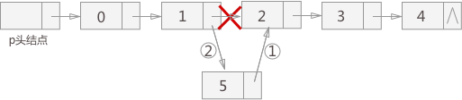

[toc]

---

>   😶‍🌫️博客地址：[https://nsddd.top](https://nsddd.top)  
>
>   >   ❤️❤️💕 区块链技术、Golang、数据结构、C/C++、MySQL、python
>
>   😶‍🌫️我的学习笔记：github: [https://github.com/3293172751/LeetCode](https://github.com/3293172751/LeetCode))

---

# 线性表（Linear List)

>   线性表是数据结构中最简单的一种，特点是数据元素之间是一对一的线性关系，数据元素一个接着一个排序

>   而在复杂的线性表中，常把元素称之为记录（Record），它是由若干个数据项（Item）组成，而含有大量记录的线性表又称之为文件（file)


### list.h

```C++
#pragma once
#include "targetver.h"

#include <stdio.h>
#include <tchar.h>

#define LIST_INIT_SIZE 100
#define MAXSIZE 100

typedef int ElemType;

typedef struct Sqlist {
    ElemType * elem;
    int length;    
    int listsize;
}Sqlist, *ListPtr;

typedef enum Status {
    success, fail, fatal, rangeerror,overflow
}Status;       //定义枚举类型

Status List_Init(ListPtr L);

void List_Destroy(ListPtr L);

void List_Clear(ListPtr L);

bool List_Empty(ListPtr L);

int List_Size(ListPtr L);

Status List_Retrieve(ListPtr L, int pos, ElemType * elem);

Status List_Locate(ListPtr L, ElemType elem, int *pos);

Status List_Insert(ListPtr L, int pos, ElemType elem);

Status List_Remove(ListPtr L, int pos);

Status List_Prior(ListPtr L, int pos, ElemType * elem);
```


### list.cpp

```C++
#include "stdafx.h"   //头文件编译
#include<iostream>
#include "List.h"
using namespace std;

Status List_Retrieve(ListPtr L, int pos, ElemType * elem) {
    Status status = rangeerror;
    int len = L->length;
    if (1 <= pos&&pos <= len) {
        *elem = L->elem[pos];
        status = success;
    }
    return status;
}

Status List_Locate(ListPtr L, ElemType elem, int * pos) {
    Status status = rangeerror;
    int len = L->length;
    int i = 1;
    while (i <= len && L->elem[i]==elem) {
        i++;
    }
    if (i <= len) {
        *pos = i;
        status = success;
    }
    return status;
}

Status List_Insert(ListPtr L, int pos, ElemType elem) {
    Status status = rangeerror;
    int len = L->length,i;
    if (len > MAXSIZE)status = overflow;
    else if (1 <= pos && pos <= len + 1) {
        for (i = len; i >= pos; i--)
            L->elem[i + 1] = elem;
        L->elem[pos] = elem;
        L->length++;
        status = success;
    }
    return status;
}

Status List_Init(ListPtr L) {
    Status status = fatal;
    L->elem = (ElemType*)malloc((MAXSIZE + 1) * sizeof(ElemType));
    if (L->elem) {
        L->length = 0;
        status = success;
    }
    return status;
}

void List_Destroy(ListPtr L) {
    if (L->elem) {
        free(L->elem);
        L->elem = NULL;
    }
    L->length = 0;
}

void List_Clear(ListPtr L) {
    L->length = 0;
}

bool List_Empty(ListPtr L) {
    return L->length == 0;
}

Status List_Prior(ListPtr L, int pos, ElemType * elem) {
    Status status = fail;
    int len = L->length;
    if (2 <= pos && pos <= len) {
        *elem = L->elem[pos - 1];
        status = success;
    }
    return status;
}

Status List_Next(ListPtr L, int pos, ElemType * elem) {
    Status status;
    int len = L->length;
    if (1 <= pos && pos <= len - 1) {
        *elem = L->elem[pos+1];
        status = success;
    }
    return status;
}

int List_Size(ListPtr L) {
    return L->length;
}

Status List_Remove(ListPtr L, int pos) {
    Status status = rangeerror;
    int len = L->length, i;
    if (1 <= pos && pos <= len) {
        for (i = pos; i < len; i++) 
            L->elem[i] = L->elem[i + 1];
        L->length--;
        status = success;
    }
    return status;
}


Status List_Union(ListPtr La, ListPtr Lb) {
    ElemType elem;
    Status status= fail;
    int i, len = List_Size(Lb);
    for (i = 1; i <= len; i++) {
        List_Retrieve(Lb, i, &elem);
        if (status != success) {
            status = List_Insert(La, 1, elem);
            if (status != success)break;
        }
    }
    return status;
}


Status List_Merge(ListPtr La, ListPtr Lb, ListPtr Lc) {
    ElemType elem1, elem2;
    Status status=fail;
    status = List_Init(Lc);
    if(status != success)return status;
    int i = 1, j = 1, k = 1;
    int n = List_Size(La), m = List_Size(Lb);
    while (i <= n && j <= m) {
        List_Retrieve(La, i, &elem1), List_Retrieve(Lb, j, &elem2);
        if (elem1 < elem2) {
            status = List_Insert(Lc, k, elem1);
            i++;
        }
        else {
            status = List_Insert(Lc, k, elem2);
            j++;
        }
        if (status != success) return status;
        k++;
    }
    while (i <= n) {
        List_Retrieve(La, i, &elem1);
        status = List_Insert(Lc, k, elem1);
        if (status != success) return status;
        i++, k++;
    }
    while (j <= m) {
        List_Retrieve(Lb, j, &elem2);
        status = List_Insert(Lc, k, elem2);
        if (status != success) return status;
        j++, k++;
    }
    return status;
}


int main() {
    ListPtr La = new Sqlist, Lb = new Sqlist, Lc = new Sqlist;;
    List_Init(La);
    List_Init(Lb);
    List_Init(Lc);
    int arra[5] = { 2,4,6,7,8 };
    for (int i = 1; i <= 5; i++)
        List_Insert(La, i, arra[i-1]);
    
    for(int i=1;i<=5;i++)
        cout << La->elem[i] << " ";
    cout << endl;

    int arrb[5] = { 1,5,9,10,11 };
    for (int i = 1; i <= 5; i++)
        List_Insert(Lb, i, arrb[i - 1]);

    for (int i = 1; i <= 5; i++)
        cout << Lb->elem[i] << " ";
    cout<< endl;

    Status status = List_Merge(La, Lb, Lc);
    cout << status << endl;
    if (status != success)return EXIT_FAILURE;

    for (int i = 1; i <= 10; i++)
        cout << Lc->elem[i] << " ";
    cout << endl;


    system("pause");
    return EXIT_SUCCESS;
}
```


#### 插入

**1 . 判断顺序表是否满**

```
if(L->Length >= MAXLEN){
	cout<<"满"<<endl;
	return -1;
}
```


**2. 判断顺序表是否正确**

```
if(i<0 || i>L->Length){
	cout<<"插入位置出错"<<endl;
	return 0;
}
```


**3. 判断是否插入位置为表尾**

```
if(i == Length + 1){
	L->data[i-1] = x;    //将x插入到表尾，下标为i-1
	L->Length++; 
	return 1;
}
```


**插入表中的某一个位置，移位**

```
for(j=L->Length-1;j>=i-1;j--){
	L->data[j+1] = L->data[j];
    L->data[i-1] = x;
    L->Length++;
    return 1;
}
```

**即时间复杂度为O(n)**


#### 删除

**1. 判断空**

```
if(L->Length == 0){
	cout<<"线性表为nul，不能插入"
	return 0;
}
```


**2. 删除位置的合法性**

```
if(i<1 || i>L->Length){
	...
	return 0;
}

*x = L->data[i-1];
for(j=i;j<Length;j++){
	L->data[j-1]=L->data[j];
}
L->Length--;
return 1;
```


## 链表中插入结点

链表中插入结点，根据插入位置的不同，可分为以下 3 种情况：

1.  插入到链表的首部，也就是头结点和首元结点中间；
2.  插入到链表中间的某个位置；
3.  插入到链表最末端；


[图](http://data.biancheng.net/view/200.html) 1 链表中插入结点5


虽然插入位置有区别，都使用相同的插入手法。分为 2 步，如图 1 所示：

-   将新结点的 next 指针指向插入位置后的结点；
-   将插入位置前的结点的 next 指针指向插入结点；


提示：在做插入操作时，首先要找到插入位置的上一个结点，拿图 1 来说，也就是找到结点 1，相应的结点 2 可通过结点 1 的 next 指针表示。这样，先进行步骤 1，后进行步骤 2，实现过程中不需要添加其他辅助指针。

实现代码：

```C++
link * insertElem(link * p,int elem,int add){
    link * temp=p;//创建临时结点temp
    //首先找到要插入位置的上一个结点
    for (int i=1; i<add; i++) {
        if (temp==NULL) {
            printf("插入位置无效\n");
            return p;
        }
        temp=temp->next;
    }    
    //创建插入结点c
    link * c=(link*)malloc(sizeof(link));
    c->elem=elem;
    //向链表中插入结点
    c->next=temp->next;
    temp->next=c;
    return  p;
}
```

注意，首先要保证插入位置的可行性，例如图 1 中，原本只有 5 个结点，因此插入位置可选择的范围为：1-6，如果超过 6，由于操作本身无意义，程序会提示插入位置无效。


## 链表中删除节点

当需要从链表中删除某个结点时，需要进行 2 步操作：

-   将结点从链表中摘下来;
-   手动释放掉结点，回收被结点占用的内存空间;

 

**使用 malloc 函数（或者new)申请的空间，一定要注意手动 free 掉。**否则在程序运行的整个过程中，申请的内存空间不会自己释放（只有当整个程序运行完了以后，这块内存才会被回收），造成内存泄漏，别把它当成是小问题


实现代码：

```C++
link * delElem(link * p,int add){
    link * temp=p;
    //temp指向被删除结点的上一个结点
    for (int i=1; i<add; i++) {
        temp=temp->next;
    }
    link * del=temp->next;//单独设置一个指针指向被删除结点，以防丢失
    temp->next=temp->next->next;//删除某个结点的方法就是更改前一个结点的指针域
    free(del);//手动释放该结点，防止内存泄漏
    return p;
}
```

