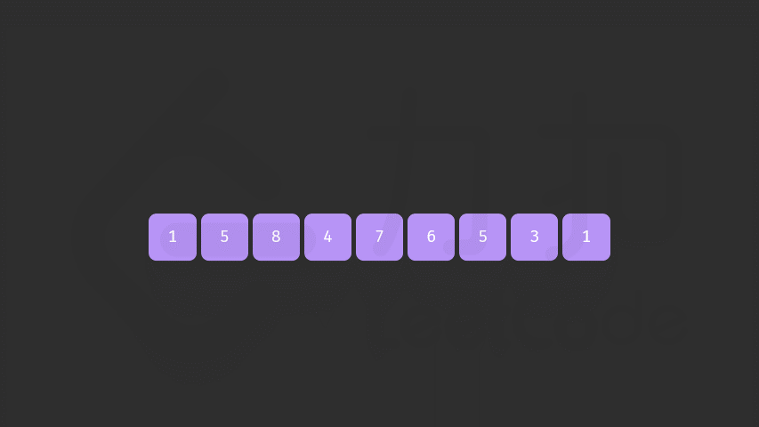

# [最接近的三数之和](https://leetcode-cn.com/problems/3sum-closest/description/)

|  Category  |   Difficulty    | Likes | Dislikes |
| :--------: | :-------------: | :---: | :------: |
| algorithms | Medium (45.77%) | 1178  |    -     |

<details open="" style="color: rgb(201, 209, 217); font-family: -apple-system, BlinkMacSystemFont, &quot;Segoe WPC&quot;, &quot;Segoe UI&quot;, system-ui, Ubuntu, &quot;Droid Sans&quot;, sans-serif, &quot;Microsoft Yahei UI&quot;; font-size: 14px; font-style: normal; font-variant-ligatures: normal; font-variant-caps: normal; font-weight: 400; letter-spacing: normal; orphans: 2; text-align: start; text-indent: 0px; text-transform: none; white-space: normal; widows: 2; word-spacing: 0px; -webkit-text-stroke-width: 0px; text-decoration-thickness: initial; text-decoration-style: initial; text-decoration-color: initial;"><summary><strong>Tags</strong></summary><p style="margin-top: 0px; margin-bottom: 0.7em;"><a href="https://leetcode.com/tag/array" title="https://leetcode.com/tag/array" style="color: var(--vscode-textLink-foreground); text-decoration: none;"><code style="color: var(--vscode-textLink-foreground); font-family: var(--vscode-editor-font-family, &quot;SF Mono&quot;, Monaco, Menlo, Consolas, &quot;Ubuntu Mono&quot;, &quot;Liberation Mono&quot;, &quot;DejaVu Sans Mono&quot;, &quot;Courier New&quot;, monospace); font-size: 1em; line-height: 1.357em; white-space: pre-wrap;">array</code></a><span>&nbsp;</span>|<span>&nbsp;</span><a href="https://leetcode.com/tag/two-pointers" title="https://leetcode.com/tag/two-pointers" style="color: var(--vscode-textLink-foreground); text-decoration: none;"><code style="color: var(--vscode-textLink-foreground); font-family: var(--vscode-editor-font-family, &quot;SF Mono&quot;, Monaco, Menlo, Consolas, &quot;Ubuntu Mono&quot;, &quot;Liberation Mono&quot;, &quot;DejaVu Sans Mono&quot;, &quot;Courier New&quot;, monospace); font-size: 1em; line-height: 1.357em; white-space: pre-wrap;">two-pointers</code></a></p></details>

<details open="" style="color: rgb(201, 209, 217); font-family: -apple-system, BlinkMacSystemFont, &quot;Segoe WPC&quot;, &quot;Segoe UI&quot;, system-ui, Ubuntu, &quot;Droid Sans&quot;, sans-serif, &quot;Microsoft Yahei UI&quot;; font-size: 14px; font-style: normal; font-variant-ligatures: normal; font-variant-caps: normal; font-weight: 400; letter-spacing: normal; orphans: 2; text-align: start; text-indent: 0px; text-transform: none; white-space: normal; widows: 2; word-spacing: 0px; -webkit-text-stroke-width: 0px; text-decoration-thickness: initial; text-decoration-style: initial; text-decoration-color: initial;"><summary><strong>Companies</strong></summary><p style="margin-top: 0px; margin-bottom: 0.7em;"><code style="color: var(--vscode-textPreformat-foreground); font-family: var(--vscode-editor-font-family, &quot;SF Mono&quot;, Monaco, Menlo, Consolas, &quot;Ubuntu Mono&quot;, &quot;Liberation Mono&quot;, &quot;DejaVu Sans Mono&quot;, &quot;Courier New&quot;, monospace); font-size: 1em; line-height: 1.357em; white-space: pre-wrap;">bloomberg</code></p></details>

给你一个长度为 `n` 的整数数组 `nums` 和 一个目标值 `target`。请你从 `nums` 中选出三个整数，使它们的和与 `target` 最接近。

返回这三个数的和。

假定每组输入只存在恰好一个解。

 

**示例 1：**

```
输入：nums = [-1,2,1,-4], target = 1
输出：2
解释：与 target 最接近的和是 2 (-1 + 2 + 1 = 2) 。
```

**示例 2：**

```
输入：nums = [0,0,0], target = 1
输出：0
```

 

**提示：**

- `3 <= nums.length <= 1000`
- `-1000 <= nums[i] <= 1000`
- `-104 <= target <= 104`

------


下一个排列算法详解：思路 + 推导 + 步骤，看不懂算我输！ - 下一个排列 - 力扣（LeetCode）

\1. 标题: 下一个排列 作者: LeetCode-Solution 摘要: 前言 本题要求我们实现一个算法，将给定数字序列重新排列成字典序中下一个更大的排列。

#### 前言

本题要求我们实现一个算法，将给定数字序列重新排列成字典序中下一个更大的排列。

以数字序列 [1,2,3][1,2,3] 为例，其排列按照字典序依次为：

[1,2,3]\\ [1,3,2]\\ [2,1,3]\\ [2,3,1]\\ [3,1,2]\\ [3,2,1][1,2,3][1,3,2][2,1,3][2,3,1][3,1,2][3,2,1]

这样，排列 [2,3,1][2,3,1] 的下一个排列即为 [3,1,2][3,1,2]。特别的，最大的排列 [3,2,1][3,2,1] 的下一个排列为最小的排列 [1,2,3][1,2,3]。

#### 方法一：两遍扫描

**思路及解法**

注意到下一个排列总是比当前排列要大，除非该排列已经是最大的排列。我们希望找到一种方法，能够找到一个大于当前序列的新序列，且变大的幅度尽可能小。具体地：

1. 我们需要将一个左边的「较小数」与一个右边的「较大数」交换，以能够让当前排列变大，从而得到下一个排列。
2. 同时我们要让这个「较小数」尽量靠右，而「较大数」尽可能小。当交换完成后，「较大数」右边的数需要按照升序重新排列。这样可以在保证新排列大于原来排列的情况下，使变大的幅度尽可能小。

以排列 [4,5,2,6,3,1][4,5,2,6,3,1] 为例：

- 我们能找到的符合条件的一对「较小数」与「较大数」的组合为 22 与 33，满足「较小数」尽量靠右，而「较大数」尽可能小。
- 当我们完成交换后排列变为 [4,5,3,6,2,1][4,5,3,6,2,1]，此时我们可以重排「较小数」右边的序列，序列变为 [4,5,3,1,2,6][4,5,3,1,2,6]。

具体地，我们这样描述该算法，对于长度为 nn 的排列 aa：

1. 首先从后向前查找第一个顺序对 (i,i+1)(i,i+1)，满足 a[i] < a[i+1]a[i]<a[i+1]。这样「较小数」即为 a[i]a[i]。此时 [i+1,n)[i+1,n) 必然是下降序列。
2. 如果找到了顺序对，那么在区间 [i+1,n)[i+1,n) 中从后向前查找第一个元素 jj 满足 a[i] < a[j]a[i]<a[j]。这样「较大数」即为 a[j]a[j]。
3. 交换 a[i]a[i] 与 a[j]a[j]，此时可以证明区间 [i+1,n)[i+1,n) 必为降序。我们可以直接使用双指针反转区间 [i+1,n)[i+1,n) 使其变为升序，而无需对该区间进行排序。





**注意**

如果在步骤 1 找不到顺序对，说明当前序列已经是一个降序序列，即最大的序列，我们直接跳过步骤 2 执行步骤 3，即可得到最小的升序序列。

该方法支持序列中存在重复元素，且在 C++ 的标准库函数 [`next_permutation`](https://leetcode.cn/link/?target=https%3A%2F%2Fen.cppreference.com%2Fw%2Fcpp%2Falgorithm%2Fnext_permutation) 中被采用。

**代码**

- C++

- Java

  ```java
  
  class Solution {
      public void nextPermutation(int[] nums) {
          int len = nums.length;
          for (int i = len - 1; i > 0; i--) {
                  if (nums[i] > nums[i - 1]) {
                      Arrays.sort(nums, i, len);
                      for (int j = i; j <len; j++) {
                          if (nums[j] > nums[i - 1]) {
                              int temp = nums[j];
                              nums[j] = nums[i - 1];
                              nums[i - 1] = temp;
                              return;
                          }
                      }
                  }
              }
      	Arrays.sort(nums);
  		return;  
      }
   }
  ```

  

- Golang

  ```go
  func nextPermutation(nums []int) {
  	if len(nums) <= 1 {
  		return
  	}
  
  	i, j, k := len(nums)-2, len(nums)-1, len(nums)-1
  
  	// find: A[i]<A[j]
  	for i >= 0 && nums[i] >= nums[j] {
  		i--
  		j--
  	}
  
  	if i >= 0 { // 不是最后一个排列
  		// find: A[i]<A[k]
  		for nums[i] >= nums[k] {
  			k--
  		}
  		// swap A[i], A[k]
  		nums[i], nums[k] = nums[k], nums[i]
  	}
  
  	// reverse A[j:end]
  	for i, j := j, len(nums)-1; i < j; i, j = i+1, j-1 {
  		nums[i], nums[j] = nums[j], nums[i]
  	}
  }
  ```

  

- C

```

void nextPermutation(vector<int>& nums) {
        next_permutation(nums.begin(),nums.end()); // STL功能和题目描述一致
  }
void nextPermutation(vector<int>& nums) {
        int i=0;
        for (i=nums.size()-2; i >= 0; -- i) { // 从后往前找到第一个相邻升序对
            if (nums[i] < nums[i+1]) break;
        }
        if (i == -1) reverse(nums.begin(),nums.end()); // 无相邻升序对，必定为非递减序列
        else {
            for (int j=nums.size()-1; j >= i+1; -- j) { // 从后往前[i+1,end)找第一个大于a[i+1]的值
                if (nums[i] < nums[j]) {
                    swap(nums[i],nums[j]); // 交换二者
                    reverse(nums.begin()+i+1,nums.end()); // 反转[i+1,end)，变成升序
                    break;
                }
            }
        }
    }
```

**复杂度分析**

- 时间复杂度：O(N)O(N)，其中 NN 为给定序列的长度。我们至多只需要扫描两次序列，以及进行一次反转操作。
- 空间复杂度：O(1)O(1)，只需要常数的空间存放若干变量。


#### 方法二

标准的“下一个排列”算法可以描述为：

- 从后向前查找第一个相邻升序的元素对 (i,j)，满足 A[i] < A[j]。此时 [j,end) 必然是降序

- 在 [j,end) 从后向前查找第一个满足 A[i] < A[k] 的 k。A[i]、A[k] 分别就是上文所说的「小数」、「大数」
- 将 A[i] 与 A[k] 交换
- 可以断定这时 [j,end) 必然是降序，逆置 [j,end)，使其升序
- 如果在步骤 1 找不到符合的相邻元素对，说明当前 [begin,end) 为一个降序顺序，则直接跳到步骤 4

```go
func nextPermutation(nums []int) {
	if len(nums) <= 1 {
		return
	}

	i, j, k := len(nums)-2, len(nums)-1, len(nums)-1

	// find: A[i]<A[j]
	for i >= 0 && nums[i] >= nums[j] {
		i--
		j--
	}

	if i >= 0 { // 不是最后一个排列
		// find: A[i]<A[k]
		for nums[i] >= nums[k] {
			k--
		}
		// swap A[i], A[k]
		nums[i], nums[k] = nums[k], nums[i]
	}

	// reverse A[j:end]
	for i, j := j, len(nums)-1; i < j; i, j = i+1, j-1 {
		nums[i], nums[j] = nums[j], nums[i]
	}
}
```

