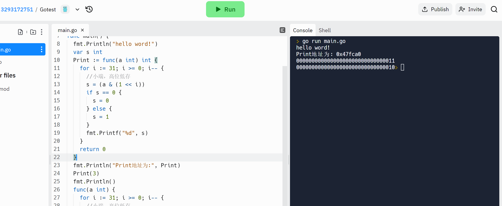

+ [author](https://github.com/3293172751)
<a href="https://github.com/3293172751" target="_blank"></a>

# 第11节 位操作和随机函数

+ [回到目录](../README.md)
+ [回到项目首页](../../README.md)
+ [上一节](10.md)
> ❤️💕💕算法学习笔记和LeetCode的刷题笔记与记录。Myblog:[http://nsddd.top](http://nsddd.top/)
---
[TOC]

## 基本说明

Go语言位运算符总结. **在 Golang 中，位运算符主要是用于数值类型的二进制的运算。**. 按位与的运算规则是，如果两数对应的二进制位都为 1，那么结果为 1， 否则结果为 0。. 按位或的运算规则是如果两数对应的二进制位有一个为 1，那么结果为 1， 否则结果为 0。. 按位异或的运算规则是如果两数对应的二进制位不同，那么结果为 1， 否则结果为 0。. 左移的运算规则是左移 N 位，就是乘以 2 的 N 次方。. 右移的运算规则是右移 N 位，就是除以 2 的 N 次方。

位运算符,对整数在内存中的二进制位进行操作
	

```go
aa := 1              //二进制001
	bb := 5              //二进制101
	fmt.Println(aa & bb) //参与运算的两数各对应的二进位相与（两位均为一才为1）
	//如   001
	//     101
	//结果为001
	//1对1为1，0与0为0，1对0为0，所以结果为001，转换为10进制就是1
	fmt.Println(aa | bb) //二进位相或，两位有一个为1就为1，所以结果为101，10进制5
	fmt.Println(aa ^ bb) //相异或，当对应二进位相异时结果为1（两位不一样则为1），100，10进制4
	fmt.Println(1 << 2)  //左移n位就是乘以2的n次方，“a<<b”就是把a的各二进位全部左移b位，高位丢弃，低位补0，结果为100,就是4
	fmt.Println(4 >> 2)  //右移n位就是除以2的n次方，“a>>b”就是把a的各二进位全部右移b位，100右移2为就是1。
```

> 我们有时候在使用取反符号的时候，可能会选择使用`-a`，但是实际上编译器需要走两步，事实上我们可以使用`~a + 1`在组成原理中我们直到计算机的补码计算是取反+1.
>
> ```go
> func main() {
> 	fmt.Println("Hello, World!")
>   a := 1
>   b := (^a+1)  //按位取反
>   fmt.Println(b)
> }
> ```
>

**与Golang不一样的是：Java中的位运算：**

移位操作符操作的运算对象也是二进制的“位”。移位操作符只可用来处理整数类型，左移位操作符（<<）能按照操作符右侧指定的位数将操作符左边的操作数向左移动（在低位补0），“有符号”右移位操作符（>>）则按照操作符右侧指定的位数将操作符左边的操作数向右移。“有符号”右移位操作符使用“符号扩展”；若符号位正，则在高位插入0；若符号位负。则在高位插入1。java中增加了一种“无符号”右移位操作符（>>>）,他使用“零扩展”；无论正负，都在高位插入0。这一操作符是C或C++中所没有的。

**java中按位取反**

```java
class Main {
  public static void main(String[] args) {
    System.out.println("Hello world!");
    int a = 10;
    int b = (~a+1);   //按位取反
    System.out.println("b = (-a) = "+b);
  }
}
```


## 随机函数

### Java中的随机函数

```
Math.random()  //double -> [0,1)
```

生成的是0 –> 1的随机数，可以对其进行乘除改变随机范围.

> 测试函数

```java
class Main {
  public static void main(String[] args) {
    System.out.println("Hello world!");
    //统计小于0.3的数出现的次数
    double a = 10000000;
    double count = 0;   //统计次数
    for(int i = 0; i < a; i++) {
      if(Math.random() < 0.3) {
        count++;
      }
    }
    System.out.println("小于0.3的概率位："+(double)count / a );
  }
}
```

> 编译

```
$ sh -c javac -classpath .:target/dependency/* -d . $(find . -type f -name '*.java')
$ java -classpath .:target/dependency/* Main
Hello world!
小于0.3的概率位：0.3000466
```


### Go中的随机函数

- [x] [Go语言函数与数组](https://github.com/3293172751/Block_Chain/blob/master/markdown/Go%E8%AF%AD%E8%A8%80%E7%9A%84%E5%87%BD%E6%95%B0%E4%B8%8E%E6%95%B0%E7%BB%84.md#unix%E6%97%B6%E9%97%B4%E6%88%B3%E5%92%8Cunixnano%E6%97%B6%E9%97%B4%E6%88%B3)

go中生成随机数的有两个包,分别是“math/rand”和“crypto/rand”,

+ 前者实现了伪随机数生成器,
+ 后者实现了用于加解密的跟安全的随机数生成器,当然,性能也就降下来了,毕竟鱼与熊掌不可兼

```go
func main() {
	// 我们一般使用系统时间的不确定性来进行初始化
	rand.Seed(time.Now().Unix())
	for i:=0; i<10; i++ {
		fmt.Print(rand.Intn(10), " ")
	}
}
```


## 打印二进制

> 使用一个函数$$print()$$打印一个`int`数的二进制信息

```java
public static void print(int num) {
	for(int i = 31; i >= 0; i--) {
        System.out.println((num & (1 << i) == 0 ? "0" : "1"));
    }
    System.out.println();
}
```

**Go语言实现**

```go
package main

import (
	"fmt"
)

func main() {
	fmt.Println("hello word!")
	var s int
	Print := func(a int) int {
		for i := 31; i >= 0; i-- {
			//小端，高位低存
			s = (a & (1 << i))
			if s == 0 {
				s = 0
			} else {
				s = 1
			}
			fmt.Printf("%d", s)
		}
		return 0
	}
	fmt.Println("Print地址为:", Print)
	Print(3)
	fmt.Println()
	func(a int) {
		for i := 31; i >= 0; i-- {
			//小端，高位低存
			s = (a & (1 << i))
			if s == 0 {
				s = 0
			} else {
				s = 1
			}
			fmt.Printf("%d", s)
		}
	}(2)
}
```



> 为什么需要if -- else 判断呢？
>
> 如果不进行判断的话，或许会有进位，产生的效果可能就是`00000000000000000000000000000021`


## END 链接

+ [回到目录](../README.md)
+ [上一节](10.md)
+ [下一节](12.md)
---
+ [参与贡献❤️💕💕](https://github.com/3293172751/Block_Chain/blob/master/Git/git-contributor.md)