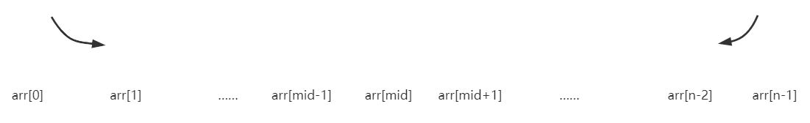

+ [author](https://github.com/3293172751)
<a href="https://github.com/3293172751" target="_blank"></a>

# 第13节 二分查找数组以及对数器使用

+ [回到目录](../README.md)
+ [回到项目首页](../../README.md)
+ [上一节](12.md)
> ❤️💕💕算法学习笔记和LeetCode的刷题笔记与记录。Myblog:[http://nsddd.top](http://nsddd.top/)
---
[TOC]

> 相比较Golang和Java，对应的数组分别为切片、map和动态数组。

## 二分查找数组的某个元素

> 二分查找的前提条件是要求数组必须是有序数组。

```java
public static booblean find(int[] arr, int num) {
	if(arr == null || arrr.length ==0 ) {
        //如果数组为空，或者数组长度为0
        return false;
    }
    int l,r = 0, arr.length - 1;
    while( l <= r) {
        int mid = ((r - l) >> 1) + l;
        if(arr[mid] == num) {
            return true;
        }else if(arr[mid] < num) {
            l = mid + 1;    //注意处理边界值
        }else {
            r = mid - 1;
        }
    }
    return false;   //如果说 l !> r，找不到了
}
```


## 对数器

> 1. 你想要测的方法a
>
> 2. 实现复杂度不好但是容易实现的方法b
>
> 3. 实现一个随机样本产生器
>
> 4. 把方法a和方法b跑相同的随机样本，看看得到的结果是否一样
>
> 5. 如果有一个随机样本使得比对结果不一致，打印样本进行人工干预，改对方法a和方法b
>
> 6. 当样本数量很多时比对测试依然正确，可以确定方法a已经正确。

> 所谓的对数器，是使用暴力的方法来检测代码。

对于一个问题，我们一般是至少有两种不同的解决方法。一种是很容易想到的但是效率很低，一种是不容易想到的，但是正确性未知，运行效率比较高，使用对数器的方法就是用来检测这种正确性未知的代码。

```java

import java.util.Arrays;
class Main {
 
	//测试冒泡排序是否正确
	public static void main(String[] args) {
		int testTime = 500000;
		int maxSize = 100; // 随机数组的长度0～100
		int maxValue = 100;// 值：-100～100
		boolean succeed = true;
		for (int i = 0; i < testTime; i++) {
			int[] arr1 = generateRandomArray(maxSize, maxValue);
			int[] arr2 = copyArray(arr1);
			insertionSort(arr1);
			comparator(arr2);
			if (!isEqual(arr1, arr2)) {
				// 打印arr1
				// 打印arr2
				succeed = false;
				break;
			}
		}
		System.out.println(succeed ? "Nice!" : "Fucking fucked!");
 
		int[] arr = generateRandomArray(maxSize, maxValue);
		printArray(arr);
		insertionSort(arr);
		printArray(arr);
	}
 
    public static void insertionSort(int[] arr) {
		if (arr == null || arr.length < 2) {
			return;
		}
		//冒泡排序，相当于a
		// 0~0 有序的
		// 0~i 想有序
		for (int i = 1; i < arr.length; i++) { // 0 ~ i 做到有序
			
			// arr[i]往前看，一直交换到合适的位置停止
			// ...(<=)  ?       <- i
			for (int j = i - 1; j >= 0 && arr[j] > arr[j + 1]; j--) {
				swap(arr, j, j + 1);
			}
		}
	}
 
	
	// i和j是一个位置的话，会出错
	public static void swap(int[] arr, int i, int j) {
		arr[i] = arr[i] ^ arr[j];
		arr[j] = arr[i] ^ arr[j];
		arr[i] = arr[i] ^ arr[j];
	}
 
	// 系统自带排序，相当于b
	public static void comparator(int[] arr) {
		Arrays.sort(arr);
	}
 
	// 随机数生成器
	public static int[] generateRandomArray(int maxSize, int maxValue) {
		// Math.random() ->  [0,1) 所有的小数，等概率返回一个
		// Math.random() * N -> [0,N) 所有小数，等概率返回一个
		// (int)(Math.random() * N) -> [0,N-1] 所有的整数，等概率返回一个
		int[] arr = new int[(int) ((maxSize + 1) * Math.random())]; // 长度随机 
		for (int i = 0; i < arr.length; i++) {
			arr[i] = (int) ((maxValue + 1) * Math.random()) 
					- (int) (maxValue * Math.random());
		}
		return arr;
	}
 
	// 复制随机数组
	public static int[] copyArray(int[] arr) {
		if (arr == null) {
			return null;
		}
		int[] res = new int[arr.length];
		for (int i = 0; i < arr.length; i++) {
			res[i] = arr[i];
		}
		return res;
	}
 
	// 比较俩次排序是否相等
	public static boolean isEqual(int[] arr1, int[] arr2) {
		if ((arr1 == null && arr2 != null) || (arr1 != null && arr2 == null)) {
			return false;
		}
		if (arr1 == null && arr2 == null) {
			return true;
		}
		if (arr1.length != arr2.length) {
			return false;
		}
		for (int i = 0; i < arr1.length; i++) {
			if (arr1[i] != arr2[i]) {
				return false;
			}
		}
		return true;
	}
 
	// for test
	public static void printArray(int[] arr) {
		if (arr == null) {
			return;
		}
		for (int i = 0; i < arr.length; i++) {
			System.out.print(arr[i] + " ");
		}
		System.out.println();
	}
 
}
```


## 局部最小值

> 给定一个不包含相同元素的整数数组，求一个局部最小值。

### 解题

1. 数组第一个元素比第二个元素小，即为局部最小值。

2. 数组最后一个元素比它前一个元素小，即为局部最小值。

3. 若不满足，那么局部最小值必可在数组首尾两元素之间的某个位置取得。此时可以采用二分法思想，看中间位置是否符合条件，不符合就分成两部分，从不符合的那一边继续操作。

[](https://img2020.cnblogs.com/blog/2024073/202201/2024073-20220103221309583-2006055275.png)

### 代码

```java
class Main {
// arr整体无序
    // arr 相邻的数不相等
    public static int findLM(int[] arr) {
        if (arr == null || arr.length == 0) { //数组为空或数据长度为0
            return -1;
        }
        if (arr.length == 1) { //数组只有一个元素即为局部最小值
            return 0;
        }
        if (arr[0] < arr[1]) { 
            //数组第一个元素比第二个元素小，即为局部最小值
            return 0;
        }
        if (arr[arr.length - 1] < arr[arr.length - 2]) {
            //数组最后一个元素比它前一个元素小，即为局部最小值
            return arr.length - 1;                     
        }
        //上述条件均不满足，局部最小值必在数组内部取得
        //用二分法思想求解
        int left = 0, right = arr.length - 1;
        while (left < right) {
            int mid = left + ((right - left) >> 1);
            if (arr[mid] > arr[mid - 1]) {   //此时放弃右边,找左边
                right = mid - 1;
            } else if (arr[mid] > arr[mid + 1]) {   //此时放弃左边,找右边
                left = mid + 1;
            } else {
                return mid;
            }
        }
        return -1;
    }

    public static void main(String[] args) {
        //测试
        int[] arr = {4,3,6,8,2,1,5,7};
        int res = findLM(arr);
        if(res < 0) {
          System.out.println("最小值不存在");
        } else {
          System.out.println(arr[res]);
        }
    }
}
```

**test**

```
 sh -c javac -classpath .:target/dependency/* -d . $(find . -type f -name '*.java')
 java -classpath .:target/dependency/* Main
3
```


## 综合

> 在第三步中求局部最小值的时候,加入随机和测试方法

### 随机

+ 之前我们直到了`random()`生成的是$$ \mathbf{{\color{Green} \left [ 0,1 \right ) }} $$之间的随即数,使用传入的maxLen扩充

```java
//生成随机数组,且相邻不相等
public static int[] randomArray(int maxLen, int maxValue) {
	int len = (int)(Math.random() * maxLen);    
	int[] arr = new int[len];   //随机生成数组长度
    if(len > 0) {
        arr[0] = (int)(Math.random() * maxValue);
        for(int i = 1; i < len; i++) {
            //保证相邻不相等
            do{
                arr[i] = (int) (Math.random() * maxValue);
            } while (arr[i] == arr[i + 1]);
        }
    }
    return arr;
}
```

### 验证方法

```java
//生成随机数组,且相邻不相等
public static int[] text(int[] arr, int minIndex) {
	if(arr.length == 0) {
        return minIndex == -1;
    }
    int left = minIndex - 1;
    int right = minIndex + 1;
    boolean leftBigger = left >= 0 ? arr[left] > arr[minIndex]:true;
    boolean reftBigger = right < arr.length ? arr[left] > arr[minIndex]:true;
    return leftBigger && reftBigger;
}
```

### 测试

```java
  public static void printAarray(int[] arr) {
    for (int num : arr) {
      System.out.print(num + " ");
    }
    System.out.println();
  }
```

### 完整代码

+ [代码地址Repl](https://replit.com/@3293172751/java-18?v=1)

```java
class Main {
  // arr整体无序
  // arr 相邻的数不相等
  public static int findLM(int[] arr) {
    if (arr == null || arr.length == 0) { // 数组为空或数据长度为0
      return -1;
    }
    if (arr.length == 1) { // 数组只有一个元素即为局部最小值
      return 0;
    }
    if (arr[0] < arr[1]) {
      // 数组第一个元素比第二个元素小，即为局部最小值
      return 0;
    }
    if (arr[arr.length - 1] < arr[arr.length - 2]) {
      // 数组最后一个元素比它前一个元素小，即为局部最小值
      return arr.length - 1;
    }
    // 上述条件均不满足，局部最小值必在数组内部取得
    // 用二分法思想求解
    int left = 0, right = arr.length - 1;
    while (left < right) {
      int mid = left + ((right - left) >> 1);
      if (arr[mid] > arr[mid - 1]) { // 此时放弃右边,找左边
        right = mid - 1;
      } else if (arr[mid] > arr[mid + 1]) { // 此时放弃左边,找右边
        left = mid + 1;
      } else {
        return mid;
      }
    }
    return -1;
  }

  // 生成随机数组,且相邻不相等
  public static int[] randomArray(int maxLen, int maxValue) {
    int len = (int) (Math.random() * maxLen);
    int[] arr = new int[len]; // 随机生成数组长度
    if (len > 0) {
      arr[0] = (int) (Math.random() * maxValue);
      for (int i = 1; i < len; i++) {
        // 保证相邻不相等
        do {
          arr[i] = (int) (Math.random() * maxValue);
        } while(arr[i] == arr[i + 1]);
      }
    }
    return arr;
  }

  // 生成随机数组,且相邻不相等
  public static boolean text(int[] arr, int minIndex) {
    if (arr.length == 0) {
      return minIndex == -1;
    }
    int left = minIndex - 1;
    int right = minIndex + 1;
    boolean leftBigger = left >= 0 ? arr[left] > arr[minIndex] : true;
    boolean reftBigger = right < arr.length ? arr[left] > arr[minIndex] : true;
    return leftBigger && reftBigger;
  }

  public static void printAarray(int[] arr) {
    for (int num : arr) {
      System.out.print(num + " ");
    }
    System.out.println();
  }

  public static void main(String[] args) {
    // 测试
    int maxLen = 5;
    int maxValue = 20;
    int testTime = 100000;
    for (int i = 0; i < testTime; i++) {
      int[] arr = randomArray(maxLen, maxValue);
      int ans = findLM(arr);
      if (!text(arr, ans)) {
        printAarray(arr);
        System.out.println(arr);
        break;
      }
    }
    System.out.println("测试通过");
  }
}
```


## END 链接

+ [回到目录](../README.md)
+ [上一节](12.md)
+ [下一节](14.md)
---
+ [参与贡献❤️💕💕](https://github.com/3293172751/Block_Chain/blob/master/Git/git-contributor.md)