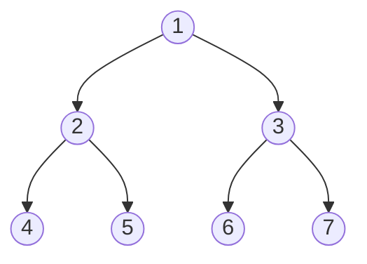

+ [author](https://github.com/3293172751)
<a href="https://github.com/3293172751" target="_blank"></a></p>

# 第15节 二叉树

+ [回到目录](../README.md)
+ [回到项目首页](../../README.md)
+ [上一节](14.md)
> ❤️💕💕算法学习笔记和LeetCode的刷题笔记与记录。Myblog:[http://nsddd.top](http://nsddd.top/)
---
[TOC]

## 二叉树的节点结构

树由节点组成，每个节点的数据结构是这样的（一个数据、两个指针如果有节点就指向节点、没有节点就指向nil）


> 二叉树每个结点有两条出边，因此指针域有两个——分别指向左子树和右子树的根结点地址，因此右把这种链表叫做二叉链表。其Go语言定义方式如下：

```go
// 二叉树结构定义 
type node struct {
    data  int    // 数据域
    left  *node  // 指向左子树的根结点
    right *node  // 指向右子树的根结点 
}
```

如果需要新建结点，可以使用下面的函数

```go
func NewNode(data int) *node {
    return &node{data: data}
}
```


**Java中是这样定义的：**

```java
class Node<N> {
    public static class Node {
        V value;
        Node left;
        Node right;
    }
    
    public Node(int data) {
        this.value = data;
    }
}
```

> 二叉树的常用操作有以下几个：
> 二叉树的建立、
> 以及二叉树结点的查找、修改、插入与删除。
>
> 一般需要实现的是：递归和非递归实现二叉树前序遍历、中序遍历、后序遍历。（针对头在左中右）


## 二叉树的遍历

对于下面一个二叉树



### 递归实现

> 通过打印选择的时机选择前序遍历、中序遍历、后序遍历。

```java
public static void Recur(Node head) {
    if(head == null) {
        return;
    }
    System.out.println(head.value + " ");    //前序遍历
    Recur(head.left);
    System.out.println(head.value + " ");    //中序遍历
    Recur(head.right);
    System.out.println(head.value + " ");    //后序遍历
}
```


### 非递归实现

> 任何递归都可以改为非递归函数，需要准备一个栈

对于下面一个二叉树
$$
\Downarrow \frac{1,2,4,4,4,2,5,5,5,2,}{1,3,6,6,6,3,7,7,7,3,1}
$$


#### 先序

$$
1,2,4,5,3,6,7
$$


+ 每次从栈弹出一个结点car
+ 打印car（处理）car
+ **先把car右孩子压入栈，再把car左孩子压入栈（如果有）**

> 先压1，出1
>
> 再压3，压2，出2，出3
>
> 先压5，压4，出4，出5
>
> …..

```java
public static void  preOrderUnRecur(Node head) {
	if(head != null) {
        Stack<Node> stack = new Stack<Node>(); //建栈
        stack.add(head);  //入头
        while(!stack.isEmpty()) {	//栈非空
        	head = stack.pop();	//弹出一个结点
            System.out.println(head.value + " ");
            if(head.right != null) {	//右孩子不为空，压入右孩子
            	stack.push(head.right);
            }
            if(head.left != null) {		//左孩子不为空，压入右孩子
            	stack.push(head.left);
            }
        }
    }
    System.out.println();
}
```


#### 后序


$$
4,5,2,6,7,3,1
$$

+ 准备两个栈
+ 每次从第一个栈弹出一个结点car放到第二个栈中
+ **先把car左孩子压入栈，再把car右孩子压入栈（如果有）**

> 1进栈1，进栈2      – 1
>
> 2，3进栈1，3进栈2，压入3的左右     – 3
>
> 6，7进栈1，7进栈2，压入7的左右null   –7
>
> 弹出6进入栈2，无左右， –6
>
> 弹出2进入栈2，压入2的左右   – 2
>
> 4，5进栈1，压入搜集栈   – 5，4
>
> 打印搜集栈`4,5,3,6,7,3,1`

```java
public static void  preOrderUnRecur(Node head) {
	if(head != null) {
        Stack<Node> stack1 = new Stack<Node>(); //建栈
        Stack<Node> stack2 = new Stack<Node>(); //建栈
        stack1.push(head);  //入头
        while(!stack1.isEmpty()) {	//栈非空
        	head = stack1.pop();	//弹出一个结点
            stack2.push(head);   //入第二个栈中
            if(head.right != null) {	//右孩子不为空，压入右孩子
            	stack1.push(head.left);
            }
            if(head.left != null) {		//左孩子不为空，压入右孩子
            	stack2.push(head.right);
            }
        }
        while(!stack2.isEmpty()) {  //打印第二个栈中
            System.out.print(s2.pop().value + " ");
        }
    }
    System.out.println();
}
```


### 中序

$$
4,2,5,1,6,3,7
$$


+ 每颗子树，整个数左边界进栈
+ 依次弹出结点的过程中，对弹出结点的右树重复

> 1，2，4进去，4没有右树，打印4     – 4
>
> 2有右树，弹出2，进5，5弹出，没有右数    –2，5
>
> 1弹出，有右数，压入3和所有左子树6  –1
>
> 弹出6没右数，  –6
>
> 弹出3，有右数，7进   –3
>
> 弹出7，无右数，  –7

```java
public static void  inOrderUnRecur(Node head) {
	if(head != null) {
        Stack<Node> stack = new Stack<Node>(); //建栈
        while(!stack.isEmpty() || head != null) {	//栈非空,且头不为空
            if(head != null) {	//右孩子不为空，压入右孩子
                stack.puth(head);
                head = head.left;   //head进栈，并往左走  -- 左边界进栈
            }else{
                //当head为空，就开始弹出结
                head = stack.pop();
                System.out.pritnln(head.value + " ");
                head = head.right;   //往右走
            }
        }
    }
    System.out.println();
}
```

### 层次遍历


> 层次遍历相对来说要简单很多，也称作宽度优先遍历，用到了数组的知识。

$$
1，2，3，4，5，6，7，
$$

```java
public int widthOfBinaryTree(TreeNode root) {
    if(head == null) {
        //空结点，就没有咯
        return;
    }
    Queue<Node> queue = new LinkedLidt<>();  //准备一个队列
    queue.add(head);	//先放入头结点
    while(!queue.isEmpty()) {
        Node cur = queue.poll();
        System.out.println(cur.value);
        if(cur.left != null) {
            queue.add(cur.left);
        }
        if(cur.right != null) {
            queue.add(cur.rigth);
        }
    }
    
}
```


## 二叉树的查找

```go
func (nd *node) Search(dt int) *node {
    if nd == nil {
        return nil
    }
    //1
    if dt == nd.data {  
        return nd
    }

    //2 大于当前节点，递归右边
    if dt > nd.data {
        return nd.right.Search(dt)
    }
    //2 大于当前节点，递归左边
    if dt < nd.data {
        return nd.left.Search(dt)
    }
    return nil
}
```


## Go语言完整遍历代码

+ [代码地址沙盒](https://replit.com/@3293172751/Gotest?v=1)

```go
package main

import (
	"fmt"
)

type Node struct {
	Value       int
	Left, Right *Node
}

func (node *Node) Print() {
	fmt.Print(node.Value, " ")
}

func (node *Node) SetValue(v int) {
	if node == nil {
		fmt.Println("setting value to nil.node ignored.")
		return
	}
	node.Value = v
}

//前序遍历
func (node *Node) PreOrder() {
	if node == nil {
		return
	}
	node.Print()
	node.Left.PreOrder()
	node.Right.PreOrder()
}

//中序遍历
func (node *Node) MiddleOrder() {
	if node == nil {
		return
	}
	node.Left.MiddleOrder()
	node.Print()
	node.Right.MiddleOrder()
}

//后序遍历
func (node *Node) PostOrder() {
	if node == nil {
		return
	}
	node.Left.PostOrder()
	node.Right.PostOrder()
	node.Print()
}

//层次遍历(广度优先遍历)
func (node *Node) BreadthFirstSearch() {
	if node == nil {
		return
	}
	result := []int{}
	nodes := []*Node{node}
	for len(nodes) > 0 {
		curNode := nodes[0]
		nodes = nodes[1:]
		result = append(result, curNode.Value)
		if curNode.Left != nil {
			nodes = append(nodes, curNode.Left)
		}
		if curNode.Right != nil {
			nodes = append(nodes, curNode.Right)
		}
	}
	for _, v := range result {
		fmt.Print(v, " ")
	}
}

//层数(递归实现)
//对任意一个子树的根节点来说，它的深度=左右子树深度的最大值+1
func (node *Node) Layers() int {
	if node == nil {
		return 0
	}
	leftLayers := node.Left.Layers()
	rightLayers := node.Right.Layers()
	if leftLayers > rightLayers {
		return leftLayers + 1
	} else {
		return rightLayers + 1
	}
}

//层数(非递归实现)
//借助队列，在进行按层遍历时，记录遍历的层数即可
func (node *Node) LayersByQueue() int {
	if node == nil {
		return 0
	}
	layers := 0
	nodes := []*Node{node}
	for len(nodes) > 0 {
		layers++
		size := len(nodes) //每层的节点数
		count := 0
		for count < size {
			count++
			curNode := nodes[0]
			nodes = nodes[1:]
			if curNode.Left != nil {
				nodes = append(nodes, curNode.Left)
			}
			if curNode.Right != nil {
				nodes = append(nodes, curNode.Right)
			}
		}
	}
	return layers
}

func CreateNode(v int) *Node {
	return &Node{Value: v}
}

func main() {
	root := Node{Value: 3}
	root.Left = &Node{}
	root.Left.SetValue(0)
	root.Left.Right = CreateNode(2)
	root.Right = &Node{5, nil, nil}
	root.Right.Left = CreateNode(4)

	fmt.Print("\n前序遍历: ")
	root.PreOrder()
	fmt.Print("\n中序遍历: ")
	root.MiddleOrder()
	fmt.Print("\n后序遍历: ")
	root.PostOrder()
	fmt.Print("\n层次遍历: ")
	root.BreadthFirstSearch()
	fmt.Println("\n层数: ", root.Layers())
	fmt.Println("\n层数: ", root.LayersByQueue())}
}
```


## 求二叉树的宽度

**Example 1:**


```
Input: root = [1,3,2,5,3,null,9]
Output: 4
Explanation: The maximum width exists in the third level with length 4 (5,3,null,9).
```

+ [x] [leetcode](https://leetcode.cn/problems/maximum-width-of-binary-tree/)

+ [x] [leetcode.com](https://leetcode.com/problems/maximum-width-of-binary-tree/)

> 求二叉树的宽度，我们还需要知道的是二叉树的层数，我们可以用一个表记录二叉树的层数。
>
> 这个题目除了用哈希表（宽度优先搜索之外），还可以用深度优先搜索。

### 哈希表

```java
    public static int wmax(Node head){
        if (head == null){
            return 0;
        }
        Queue<Node> queue = new LinkedList<>();
        queue.add(head);
        HashMap<Node, Integer> map = new HashMap<>();
        map.put(head,1);
        int curLever = 1;
        int curLeverNodes = 0;
        int max = Integer.MIN_VALUE;
        while (queue != null){
            Node cur = queue.poll();
            int curNodeLevel = map.get(cur);
            if (curNodeLevel == curLever){
                curLeverNodes++;
            }else {
                max = Math.max(max,curLeverNodes);
                curLever++;
                curLeverNodes = 1;
            }
            System.out.println(cur.value + " ");
            if (cur.left != null){
                map.put(cur.left,curLever+1);
                queue.add(cur.left);
            }
            if (cur.right != null){
                map.put(cur.right,curLever+1);
                queue.add(cur.right);
            }
        }
        return max;
    }

```

### 深度优先搜索

想法和算法

按照深度优先的顺序，我们记录每个节点的 position 。对于每一个深度，第一个到达的位置会被记录在 left[depth] 中。

然后对于每一个节点，它对应这一层的可能宽度是 pos - left[depth] + 1 。我们将每一层这些可能的宽度去一个最大值就是答案。

```java
class Solution {
    int ans;
    Map<Integer, Integer> left;
    public int widthOfBinaryTree(TreeNode root) {
        ans = 0;
        left = new HashMap();
        dfs(root, 0, 0);
        return ans;
    }
    public void dfs(TreeNode root, int depth, int pos) {
        if (root == null) return;
        left.computeIfAbsent(depth, x-> pos);
        ans = Math.max(ans, pos - left.get(depth) + 1);
        dfs(root.left, depth + 1, 2 * pos);
        dfs(root.right, depth + 1, 2 * pos + 1);
    }
}
```

复杂度分析

+ 时间复杂度： O(N)O(N) ，其中 NN 是树中节点的数目，我们需要遍历每个节点。

+ 空间复杂度： O(N)O(N) ，这部分空间是因为我们 DFS 递归过程中有 NN 层的栈。


## END 链接

+ [回到目录](../README.md)
+ [上一节](14.md)
+ [下一节](16.md)
---
+ [参与贡献❤️💕💕](https://github.com/3293172751/Block_Chain/blob/master/Git/git-contributor.md)