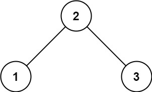
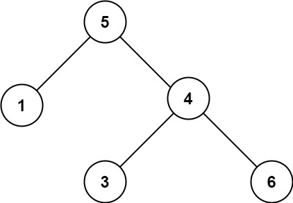
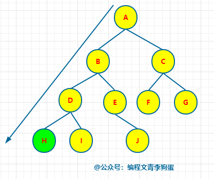
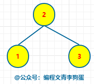
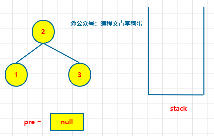
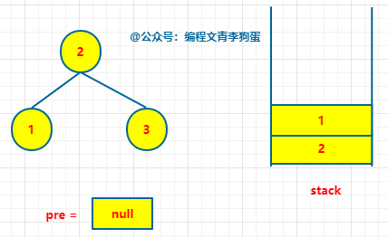
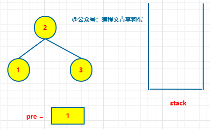
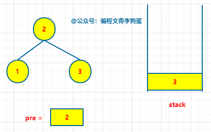
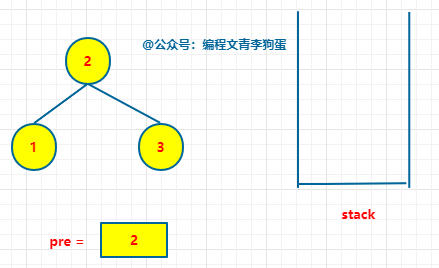
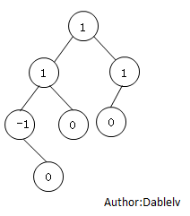

+ [author](https://github.com/3293172751)
<a href="https://github.com/3293172751" target="_blank"></a></p>

# 第18节 二叉树题目补充

+ [回到目录](../README.md)
+ [回到项目首页](../../README.md)
+ [上一节](17.md)
> ❤️💕💕算法学习笔记和LeetCode的刷题笔记与记录。Myblog:[http://nsddd.top](http://nsddd.top/)
---
[TOC]

## 判断一颗二叉树是否是搜索二叉树

+ [x] [leetcode](https://leetcode.cn/problems/validate-binary-search-tree)
+ [x] [leetcode.com](https://leetcode.com/problems/validate-binary-search-tree)

> 二叉树的套路都是固定的

给你一个二叉树的根节点 root ，判断其是否是一个有效的二叉搜索树。

有效 二叉搜索树定义如下：

1. 节点的左子树只包含 小于 当前节点的数。
2. 节点的右子树只包含 大于 当前节点的数。
3. 所有左子树和右子树自身必须也是二叉搜索树。

示例 1：



```
输入：root = [2,1,3]
输出：true
```

示例 2：



```
输入：root = [5,1,4,null,null,3,6]
输出：false
```

解释：根节点的值是 5 ，但是右子节点的值是 4 。

> 我们使用`中序遍历`，如果遍历的结果是`升序`排序的，那么这个二叉树一定是个二叉搜索树。


### 中序遍历解题

```java
/**
 * Definition for a binary tree node.
 * public class TreeNode {
 *     int val;
 *     TreeNode left;
 *     TreeNode right;
 *     TreeNode() {}
 *     TreeNode(int val) { this.val = val; }
 *     TreeNode(int val, TreeNode left, TreeNode right) {
 *         this.val = val;
 *         this.left = left;
 *         this.right = right;
 *     }
 * }
 */
class Solution {
    long preVaLue = Long.MIN_VALUE;   //开始设置为整数最小值 int
    public boolean isValidBST(TreeNode root) {
        if(root == null) {
            return true;
        }
        boolean isleftBst = isValidBST(root.left);
        if(isleftBst == false) {
            //如果左数不是搜索二叉树，那就直接返回
            return false;
        }
        if(root.val <= preVaLue) {
            //如果发现中序遍历后面的数小于preVaLue
            return false;
        }else{   //>
            preVaLue = root.val;
        }
        boolean isrightBst = isValidBST(root.right);
        if(isrightBst == false) {
            return false;
        }else{
            return true;
         }
        //return  isValidBST(root.right);
    }
}
```

**Go语言**

```go
func isValidBST(root *TreeNode) bool {
    return helper(root, math.MinInt64, math.MaxInt64)
}

func helper(root *TreeNode, lower, upper int) bool {
    if root == nil {
        return true
    }
    if root.Val <= lower || root.Val >= upper {
        return false
    }
    return helper(root.Left, lower, root.Val) && helper(root.Right, root.Val, upper)
}
```


### 使用哈希表记录

```java
/**
 * Definition for a binary tree node.
 * public class TreeNode {
 *     int val;
 *     TreeNode left;
 *     TreeNode right;
 *     TreeNode() {}
 *     TreeNode(int val) { this.val = val; }
 *     TreeNode(int val, TreeNode left, TreeNode right) {
 *         this.val = val;
 *         this.left = left;
 *         this.right = right;
 *     }
 * }
 */
class Solution {
    List<Integer> list = new ArrayList<>(); 
    public boolean isValidBST(TreeNode root) {
        inOrderUnderRecur(root);
        for(int i=0;i<list.size()-1;i++){
            if(list.get(i)>=list.get(i+1)) return  false;
        }
        return true;
    }
    public  void inOrderUnderRecur(TreeNode root){
        /**
         * 申请一个栈空间stack
         * 先将当前根节点压入栈空间 然后不断 遍历左子节点 当左子节点为空的时候
         * 弹出当前节点 并且打印 该节点的值，并且从该节点的右孩子开始遍历左子节点
         * 不断重复前面两个步骤 当栈为空的时候且当前节点为空的时候 结束遍历
         */
         if(root==null) return;
         Stack<TreeNode> stack = new Stack<>();
         while (!stack.isEmpty()||root!=null){
             if(root!=null) {
                 stack.push(root);
                 root=root.left;
             }else {
                 root=stack.pop();
                 System.out.print(root.val+" ");
                 list.add(root.val);
                 root=root.right;
             }
         }
    }
}
```


### 非递归方式实现

对于中序遍历而言，**访问节点的顺序和处理节点的顺序是不一致的**，并且，**处理节点是在遍历完左子树之后**。


直白点就是：**从根节点开始，一层层的遍历，找到左子树最左的那个节点，从它开始处理节点。**


例如下图中的 H 节点。




常规的**中序遍历具体步骤**如下所示：


- 初始化一个空栈。
- 当【根节点不为空】或者【栈不为空】时，从根节点开始

- - 若当前节点有左子树，一直遍历左子树，每次将当前节点压入栈中。
  - 若当前节点无左子树，从栈中弹出该节点，尝试访问该节点的右子树。


在我们这道题中，我们还需要判断【序列是否有序】，这就需要我们在从栈中弹出节点的时候，和上一次弹出的节点值作比较，如果当前的值大，那就继续之前的操作，否则就证明不是二叉搜索树。


以下图为例：



首先初始化一个空栈 stack 和一个保存前一个节点的 pre




```
stack = []
# 记录前一个节点
pre = None
```

从根节点开始，一直向左子树遍历，同时将当前的节点压入栈中。





```
# 一直向左子树走，每一次将当前节点保存到栈中
if root:
    stack.append(root)
    root = root.left
```

当前走到了最左面，弹出栈顶元素，此时 cur = 1，pre 为空，让 pre = cur。


```
cur = stack.pop()
# 判断序列是否有序
if pre and cur.val <= pre.val:
    return False
pre = cur
root = cur.right
```


弹出的节点 1 并无右子树，继续重复上述的动作。


弹出栈顶元素，此时 cur = 2，pre = 1，cur > pre，证明当前有序。




此时让 pre = cur，同时当前的节点 2 有右子树，遍历其右子树，遍历到的节点入栈。




弹出栈顶元素，此时 cur = 3，pre = 2，cur > pre，证明当前有序。



此时让 pre = cur，同时弹出的节点 3 并无右子树，至此二叉树全部遍历完，返回 True。


Python 代码实现

```python
# Definition for a binary tree node.
# class TreeNode:
#     def __init__(self, val=0, left=None, right=None):
#         self.val = val
#         self.left = left
#         self.right = right
class Solution:
    def isValidBST(self, root: TreeNode) -> bool:
        stack = []
        # 记录前一个节点
        pre = None

        while root or stack:
            # 一直向左子树走，每一次将当前节点保存到栈中
            if root:
                stack.append(root)
                root = root.left
            # 当前节点为空，证明走到了最左边，从栈中弹出节点
            # 开始对右子树重复上述过程
            else:
                cur = stack.pop()
                # 判断序列是否有序
                if pre and cur.val <= pre.val:
                    return False
                pre = cur
                root = cur.right

        return True
```


Java 代码实现

```java
/**
 * Definition for a binary tree node.
 * public class TreeNode {
 *     int val;
 *     TreeNode left;
 *     TreeNode right;
 *     TreeNode() {}
 *     TreeNode(int val) { this.val = val; }
 *     TreeNode(int val, TreeNode left, TreeNode right) {
 *         this.val = val;
 *         this.left = left;
 *         this.right = right;
 *     }
 * }
 */
class Solution {
    public boolean isValidBST(TreeNode root) {
        Stack<TreeNode> stack = new Stack<TreeNode>();
        // 记录前一个节点
        TreeNode pre = null;
        
        while(stack.size() > 0 || root != null){
            // 一直向左子树走，每一次将当前节点保存到栈中
            if(root != null){
                stack.add(root);
                root = root.left;
            }
            // 当前节点为空，证明走到了最左边，从栈中弹出节点
            // 开始对右子树重复上述过程
            else{
                TreeNode cur = stack.pop();
                // 判断序列是否有序
                if(pre != null && cur.val <= pre.val){
                    return false;
                }
                pre = cur;
                root = cur.right;
            }
        }
        return true;
    }
}
```


同样，非递归版的解法**时间复杂度为** **O(n)，空间复杂度为 O(n)**。

**图解验证二叉搜索树**到这就结束了，你看，虽然是个难度中等的题，也只是个纸老虎。

掌握了二叉搜索树的性质就掌握了这道题的解题密码，其实这道题也给我们提供了思路，有时候可以往本身的性质上靠一下。


### 套路解题

**需要满足条件**

+ 左边搜索二叉树
+ 右边搜索二叉树
+ 左边`max < x`
+ 右边`min > x`

> 你需要先左边要两个条件，先右边要两个条件，所以我们选择全部都返回三个返回值

```java
class Solution {
    public static ReturnDate process(TreeNode x) {
        if(x == null) {
            return null;   //对于max和min不好做处理，返回null，后面判断
        }
        ReturnDate leftData = process(x.left);
        ReturnDate rightData = process(x.right);

        //我也需要返回三个信息
        int min = x.value;
        int max = x.value;
        if(leftData != null) {
            //左树不为空，pk
            min = Math.min(min,leftData.min);
            max = Math.max(max,leftData.max);
        }
        if(rithtData != null) {
            //右树不为空，pk
            min = Math.min(min,rightData.min);
            max = Math.max(max,rightData.max);
        }
        
        boolean isBST = true;   //设置是否有
        if(leftData != null && (!leftData.isBST || leftData.max >= x.value)) {
            isBST = false;
            //左边不为空且(左边有东西，且左边最大值 > = x.value)
        }
        if(rightData != null && (!rightData.isBST || rithtData.min <= x.value)) {
            isBST = false;
        }

        return new ReturnDate(isBST,min,max);
    }
}
```


## 判断完全二叉树

> 在`堆`中我们知道啦满二叉树，判断方法是二叉树按照宽度遍历
>
> + 依次遍历每一个结点，如果有右孩子，没左孩子，不是
> + 上一条件基础上，如果遇到左右两个孩子不双全，那么之后遇到的所有结点，都必须是叶子结点
>
> 


### 代码

```java
public static boolean isCBT(Node head) {
    if(head == null) {
        return false;
    }
    
    LinkedList<Node> queue = nwe LinkedList<>();  //创建队列
    //时候遇到左右孩子不双全结点
    boolean leaf = false;   //设置标记位
    Node l = null;	//左孩子为空
    Node r = null;	//有孩子为空
    queue.add(head);
    while(!queue.isEmpty()) {
        head = queue.poll();
        l = head.left;
        r = head.right;
        if ((leaf && (l != null || r != null)) || (l == null && r !== null)) {
            return false;
        }
    }
    if(l != null) {
        queue.add(l)；
    }
    if(r != null) {
        queue.add(r)；
    }
    if(l == null || r == null) {
        leaf = true；
    }
    return true;
}
```


## 判断满二叉树

满二叉树的定义：一个高度为h，并且含有**2^h^ - 1**个节点的二叉树称为满二叉树，称呼满二叉树为**FBT**。

根据满二叉树的高度与节点个数之间的关系，很容易判断一棵树是否为FBT，只需要求树其树高和节点个数即可。

> 所以我们判断满二叉树就需要用这个公式了，但是需要一个套路来解题

### 套路解题

> 学会树型DP后，这种类型就很容易写了

### 代码

```java
class A{
 	public static class ReturnType {
        //两个返回值
        public int nodes; 		//个数
        public int height;		//高度
        
        public ReturnType(int nod,int hei) {
            nodes = nod;
            height = hei;
        }
    }
    public static boolean isF(Node head) {
        if(head == null) {
            return true;
        }
        ReturnType data = process(head);   //收取树的信息
        return data.nodes == (1 << (data.height - 1));
        //是否等于2 的 l 次方 - 1
    }
    public static ReturnType process(Node x) {
        if(x == null) {
            return new ReturnType(0, 0);    //高度和结点个数都是0
        }

        ReturnType leftData = process(x.left);   //左边子树返回的信息
        ReturnType rightData = process(x.right); //右边子树返回的信息

        //int height;
        //int nodes;
        int height = Math.max(leftData.height,rightData.height) + 1;
        int nodes = leftData.nodes + rightData.nodes + 1;
        return new process(height,nodes);
    }
}
```


## 判断平衡二叉树

+ [x] [leetcode](https://leetcode.cn/problems/balanced-binary-tree/)
+ [x] [leetcode.com](https://leetcode.com/problems/balanced-binary-tree/)

**对于任何一个子树来说，它的左数和右数的高度绝对值差`<=1`**



### 代码(套路解题)

**java**

```java
class A{
 	public static class ReturnType {
        //两个返回值
        public boolean isBalanced;  //是否平衡
        public int height;		   //高度
        
        public ReturnType(boolean isB,int hei) {
            isBalanced = isB;
            height = hei;
        }
    }
    public static ReturnType process(Node x) {
        if(x == null) {   //1
            return new ReturnType(true, 0);
        }
        
        //2  左右子树的递归信息
        ReturnType leftData = process(x.left);     //左树可以返回对应两个信息
        ReturnType rightData = process(x.right);   //右树可以返回对应两个信息
    
    	//3. 我也返回两个信息   
        int height = Math.max(leftData.height,rightData.height) + 1;  //返回大的那个高度+1 = 我的高度
        boolean isBalanced = leftData.isBalanced && rightData.isBalanced && Math.abs(leftData.height - rightData.height) < 2;
        //左平衡树 + 右平衡树 + 左右绝对值<1
    return  new ReturnType(isBalanced, height);
    }
}
```


**Go语言**

```go
/**
 * Definition for a binary tree node.
 * type TreeNode struct {
 *     Val int
 *     Left *TreeNode
 *     Right *TreeNode
 * }
 */
func isBalanced(root *TreeNode) bool {
    if root == nil {
        return true
    }
    return abs(height(root.Left) - height(root.Right)) <= 1 && isBalanced(root.Left) && isBalanced(root.Right)
    //对应的是左孩子减去右孩子，而且左孩子存在，右孩子也存在
}

func height(root *TreeNode) int {
    if root == nil {
        return 0
    }

    return max(height(root.Left), height(root.Right)) + 1
}

func max(x, y int) int {
    if x > y {
        return x
    }
    return y
}

func abs(x int) int {
    if x < 0 {
        return -1 * x
    }
    return x
}

```


## 二叉树递归套路

+ [x] [很好的一个网站可以学习](https://oi-wiki.org/dp/)

**二叉树中最难的是`树型DP`**

[^树型DP]: 树型动态规划题目

**类型题目，可以很多的通解，一般都是向左树要信息，右树要信息。**

[toc]


## 二叉树的最近公共祖先

+ [x] [leetcode236](https://leetcode.cn/problems/lowest-common-ancestor-of-a-binary-tree/)
+ [x] [leetcode.com](https://leetcode.com/problems/lowest-common-ancestor-of-a-binary-tree/)

### 题目描述

给定一个二叉树, 找到该树中两个指定节点的最近公共祖先。

百度百科中最近公共祖先的定义为：“对于有根树 T 的两个节点 p、q，最近公共祖先表示为一个节点 x，满足 x 是 p、q 的祖先且 x 的深度尽可能大（一个节点也可以是它自己的祖先）。”

**Example 1:**


```
Input: root = [3,5,1,6,2,0,8,null,null,7,4], p = 5, q = 1
Output: 3
Explanation: The LCA of nodes 5 and 1 is 3.
```

**Example 2:**


```
Input: root = [3,5,1,6,2,0,8,null,null,7,4], p = 5, q = 4
Output: 5
Explanation: The LCA of nodes 5 and 4 is 5, since a node can be a descendant of itself according to the LCA definition.
```

**Example 3:**

```
Input: root = [1,2], p = 1, q = 2
Output: 1
```

### 代码

```python
class Solution:
    def lowestCommonAncestor(self, root: 'TreeNode', p: 'TreeNode', q: 'TreeNode') -> 'TreeNode':
        def func(root,p,l):
            if not root: return False
            if root==p: 
                l.append(p)
                return True
            l.append(root)
            lFlag = func(root.left,p,l)
            if lFlag: return True
            rFlag = func(root.right,p,l)
            if rFlag: return True
            l.pop()
            return False
        
        path_p, path_q = [], []
        func(root, p, path_p) # 查找p的路径
        func(root, q, path_q) # 查找q的路径

        if not path_p: return p # 如果p路径为空，说明p是起点，直接返回p
        if not path_q: return q # 如果q路径为空，说明q是起点，直接返回q
        for item in path_p[::-1]: # 找到p和q的公共节点
            if item in path_q:
                return item

        return -1

```


## END 链接

+ [回到目录](../README.md)
+ [上一节](17.md)
+ [下一节](19.md)
---
+ [参与贡献❤️💕💕](https://github.com/3293172751/Block_Chain/blob/master/Git/git-contributor.md)