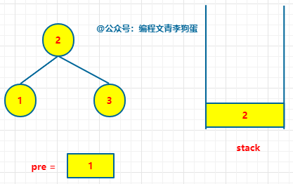

+ [author](https://github.com/3293172751)
<a href="https://github.com/3293172751" target="_blank"></a></p>

# 第18节 二叉树题目补充

+ [回到目录](../README.md)
+ [回到项目首页](../../README.md)
+ [上一节](17.md)
> ❤️💕💕算法学习笔记和LeetCode的刷题笔记与记录。Myblog:[http://nsddd.top](http://nsddd.top/)
---
[TOC]

## 判断一颗二叉树是否是搜索二叉树

+ [x] [leetcode](https://leetcode.cn/problems/validate-binary-search-tree)
+ [x] [leetcode.com](https://leetcode.com/problems/validate-binary-search-tree)

> 二叉树的套路都是固定的

给你一个二叉树的根节点 root ，判断其是否是一个有效的二叉搜索树。

有效 二叉搜索树定义如下：

1. 节点的左子树只包含 小于 当前节点的数。
2. 节点的右子树只包含 大于 当前节点的数。
3. 所有左子树和右子树自身必须也是二叉搜索树。

示例 1：


```
输入：root = [2,1,3]
输出：true
```

示例 2：


```
输入：root = [5,1,4,null,null,3,6]
输出：false
```

解释：根节点的值是 5 ，但是右子节点的值是 4 。

> 我们使用`中序遍历`，如果遍历的结果是`升序`排序的，那么这个二叉树一定是个二叉搜索树。


### 中序遍历解题

```java
/**
 * Definition for a binary tree node.
 * public class TreeNode {
 *     int val;
 *     TreeNode left;
 *     TreeNode right;
 *     TreeNode() {}
 *     TreeNode(int val) { this.val = val; }
 *     TreeNode(int val, TreeNode left, TreeNode right) {
 *         this.val = val;
 *         this.left = left;
 *         this.right = right;
 *     }
 * }
 */
class Solution {
    long preVaLue = Long.MIN_VALUE;   //开始设置为整数最小值
    public boolean isValidBST(TreeNode root) {
        if(root == null) {
            return true;
        }
        boolean isleftBst = isValidBST(root.left);
        if(isleftBst == false) {
            //如果左数不是搜索二叉树，那就直接返回
            return false;
        }
        if(root.val <= preVaLue) {
            //如果发现中序遍历后面的数小于preVaLue
            return false;
        }else{   //>
            preVaLue = root.val;
        }
        boolean isrightBst = isValidBST(root.right);
        if(isrightBst == false) {
            return false;
        }else{
            return true;
         }
        //return  isValidBST(root.right);
    }
}
```

**Go语言**

```go
func isValidBST(root *TreeNode) bool {
    return helper(root, math.MinInt64, math.MaxInt64)
}

func helper(root *TreeNode, lower, upper int) bool {
    if root == nil {
        return true
    }
    if root.Val <= lower || root.Val >= upper {
        return false
    }
    return helper(root.Left, lower, root.Val) && helper(root.Right, root.Val, upper)
}
```


### 使用哈希表记录

```java
/**
 * Definition for a binary tree node.
 * public class TreeNode {
 *     int val;
 *     TreeNode left;
 *     TreeNode right;
 *     TreeNode() {}
 *     TreeNode(int val) { this.val = val; }
 *     TreeNode(int val, TreeNode left, TreeNode right) {
 *         this.val = val;
 *         this.left = left;
 *         this.right = right;
 *     }
 * }
 */
class Solution {
    List<Integer> list = new ArrayList<>(); 
    public boolean isValidBST(TreeNode root) {
        inOrderUnderRecur(root);
        for(int i=0;i<list.size()-1;i++){
            if(list.get(i)>=list.get(i+1)) return  false;
        }
        return true;
    }
    public  void inOrderUnderRecur(TreeNode root){
        /**
         * 申请一个栈空间stack
         * 先将当前根节点压入栈空间 然后不断 遍历左子节点 当左子节点为空的时候
         * 弹出当前节点 并且打印 该节点的值，并且从该节点的右孩子开始遍历左子节点
         * 不断重复前面两个步骤 当栈为空的时候且当前节点为空的时候 结束遍历
         */
         if(root==null) return;
         Stack<TreeNode> stack = new Stack<>();
         while (!stack.isEmpty()||root!=null){
             if(root!=null) {
                 stack.push(root);
                 root=root.left;
             }else {
                 root=stack.pop();
                 System.out.print(root.val+" ");
                 list.add(root.val);
                 root=root.right;
             }
         }
    }
}
```


### 非递归方式实现

对于中序遍历而言，**访问节点的顺序和处理节点的顺序是不一致的**，并且，**处理节点是在遍历完左子树之后**。


直白点就是：**从根节点开始，一层层的遍历，找到左子树最左的那个节点，从它开始处理节点。**


例如下图中的 H 节点。


常规的**中序遍历具体步骤**如下所示：


- 初始化一个空栈。
- 当【根节点不为空】或者【栈不为空】时，从根节点开始

- - 若当前节点有左子树，一直遍历左子树，每次将当前节点压入栈中。
  - 若当前节点无左子树，从栈中弹出该节点，尝试访问该节点的右子树。


在我们这道题中，我们还需要判断【序列是否有序】，这就需要我们在从栈中弹出节点的时候，和上一次弹出的节点值作比较，如果当前的值大，那就继续之前的操作，否则就证明不是二叉搜索树。


以下图为例：


首先初始化一个空栈 stack 和一个保存前一个节点的 pre


```
stack = []
# 记录前一个节点
pre = None
```

从根节点开始，一直向左子树遍历，同时将当前的节点压入栈中。


```
# 一直向左子树走，每一次将当前节点保存到栈中
if root:
    stack.append(root)
    root = root.left
```

当前走到了最左面，弹出栈顶元素，此时 cur = 1，pre 为空，让 pre = cur。





```
cur = stack.pop()
# 判断序列是否有序
if pre and cur.val <= pre.val:
    return False
pre = cur
root = cur.right
```


弹出的节点 1 并无右子树，继续重复上述的动作。


弹出栈顶元素，此时 cur = 2，pre = 1，cur > pre，证明当前有序。


此时让 pre = cur，同时当前的节点 2 有右子树，遍历其右子树，遍历到的节点入栈。


弹出栈顶元素，此时 cur = 3，pre = 2，cur > pre，证明当前有序。


此时让 pre = cur，同时弹出的节点 3 并无右子树，至此二叉树全部遍历完，返回 True。


Python 代码实现

```python
# Definition for a binary tree node.
# class TreeNode:
#     def __init__(self, val=0, left=None, right=None):
#         self.val = val
#         self.left = left
#         self.right = right
class Solution:
    def isValidBST(self, root: TreeNode) -> bool:
        stack = []
        # 记录前一个节点
        pre = None

        while root or stack:
            # 一直向左子树走，每一次将当前节点保存到栈中
            if root:
                stack.append(root)
                root = root.left
            # 当前节点为空，证明走到了最左边，从栈中弹出节点
            # 开始对右子树重复上述过程
            else:
                cur = stack.pop()
                # 判断序列是否有序
                if pre and cur.val <= pre.val:
                    return False
                pre = cur
                root = cur.right

        return True
```


Java 代码实现

```java
/**
 * Definition for a binary tree node.
 * public class TreeNode {
 *     int val;
 *     TreeNode left;
 *     TreeNode right;
 *     TreeNode() {}
 *     TreeNode(int val) { this.val = val; }
 *     TreeNode(int val, TreeNode left, TreeNode right) {
 *         this.val = val;
 *         this.left = left;
 *         this.right = right;
 *     }
 * }
 */
class Solution {
    public boolean isValidBST(TreeNode root) {
        Stack<TreeNode> stack = new Stack<TreeNode>();
        // 记录前一个节点
        TreeNode pre = null;
        
        while(stack.size() > 0 || root != null){
            // 一直向左子树走，每一次将当前节点保存到栈中
            if(root != null){
                stack.add(root);
                root = root.left;
            }
            // 当前节点为空，证明走到了最左边，从栈中弹出节点
            // 开始对右子树重复上述过程
            else{
                TreeNode cur = stack.pop();
                // 判断序列是否有序
                if(pre != null && cur.val <= pre.val){
                    return false;
                }
                pre = cur;
                root = cur.right;
            }
        }
        return true;
    }
}
```


同样，非递归版的解法**时间复杂度为** **O(n)，空间复杂度为 O(n)**。

**图解验证二叉搜索树**到这就结束了，你看，虽然是个难度中等的题，也只是个纸老虎。

掌握了二叉搜索树的性质就掌握了这道题的解题密码，其实这道题也给我们提供了思路，有时候可以往本身的性质上靠一下。


## 判断完全二叉树

> 在`堆`中我们知道啦满二叉树，判断方法是二叉树按照宽度遍历
>
> + 依次遍历每一个结点，如果有右孩子，没左孩子，不是
> + 上一条件基础上，如果遇到左右两个孩子不双全，那么之后遇到的所有结点，都必须是叶子结点
>
> 


### 代码

```java
public static boolean isCBT(Node head) {
    if(head == null) {
        return false;
    }
    
    LinkedList<Node> queue = nwe LinkedList<>();  //创建队列
    //时候遇到左右孩子不双全结点
    boolean leaf = false;   //设置标记位
    Node l = null;	//左孩子为空
    Node r = null;	//有孩子为空
    queue.add(head);
    while(!queue.isEmpty()) {
        head = queue.poll();
        l = head.left;
        r = head.right;
        if ((leaf && (l != null || r != null)) || (l == null && r !== null)) {
            return false;
        }
    }
    if(l != null) {
        queue.add(l)；
    }
    if(r != null) {
        queue.add(r)；
    }
    if(l == null || r == null) {
        leaf = true；
    }
    return true;
}
```


## 判断满二叉树

满二叉树的定义：一个高度为h，并且含有**2^h^ - 1**个节点的二叉树称为满二叉树，称呼满二叉树为**FBT**。

根据满二叉树的高度与节点个数之间的关系，很容易判断一棵树是否为FBT，只需要求树其树高和节点个数即可。

> 所以我们判断满二叉树就需要用这个公式了，但是需要一个套路来解题


## 判断平衡二叉树

**对于任何一个子树来说，它的左数和右数的高度绝对值差`<=1`**


## 二叉树递归套路


## END 链接
+ [回到目录](../README.md)
+ [上一节](17.md)
+ [下一节](19.md)
---
+ [参与贡献❤️💕💕](https://github.com/3293172751/Block_Chain/blob/master/Git/git-contributor.md)