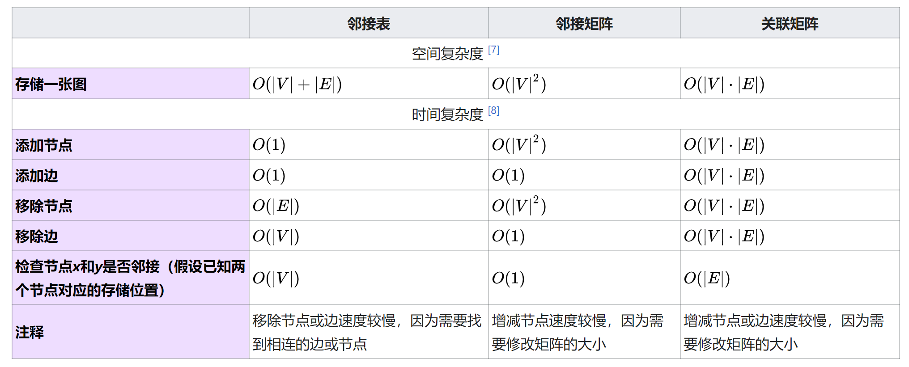
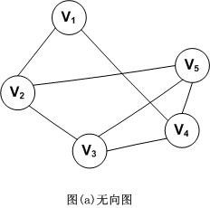
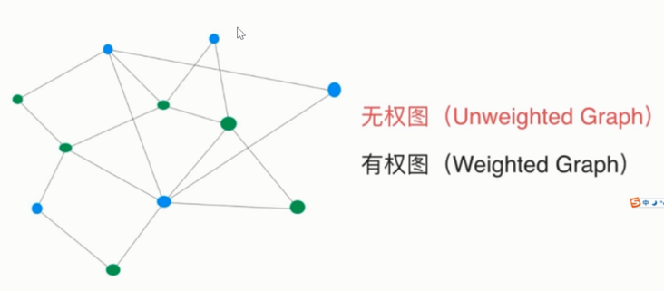
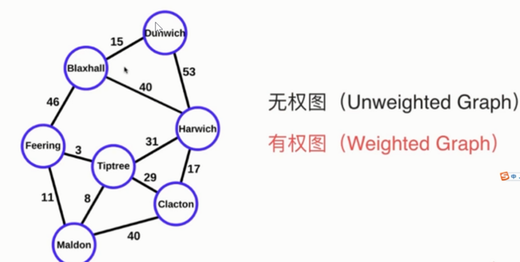
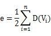
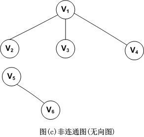
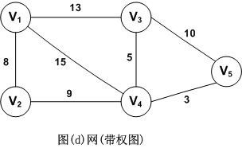

+ [author](https://github.com/3293172751)
<a href="https://github.com/3293172751" target="_blank"></a>
# 第19节 图(Graph)

+ [回到目录](../README.md)
+ [回到项目首页](../../README.md)
+ [上一节](18.md)
> ❤️💕💕算法学习笔记和LeetCode的刷题笔记与记录。Myblog:[http://nsddd.top](http://nsddd.top/)
---
[TOC]

## 图的存储方式

1. **邻接表**
2. **邻接矩阵**

**图G由两个集合V(顶点Vertex)和E(边Edge)组成，定义为G=(V，E)**


## 图的基本操作

图数据结构*G*支持的基本操作通常包括：[[1\]](https://zh.m.wikipedia.org/zh-hans/图_(数据结构)#cite_note-gt-ops-1)

- `adjacent`(*G*, *x*, *y*)：查看是否存在从节点*x*到*y*的边；
- `neighbors`(*G*, *x*)：列出所有从*x*出发的边的另一个顶点*y*；
- `add_vertex`(*G*, *x*)：如果不存在，将节点*x*添加进图；
- `remove_vertex`(*G*, *x*)：如果存在，从图中移除节点*x*；
- `add_edge`(*G*, *x*, *y*)：如果不存在，添加一条从节点*x*到*y*的边；
- `remove_edge`(*G*, *x*, *y*)：如果存在，从图中移除从节点*x*到*y*的边；
- `get_vertex_value`(*G*, *x*)：返回节点*x*上的值；
- `set_vertex_value`(*G*, *x*, *v*)：将节点*x*上的值赋为*v*。


如果该数据结构支持和边关联的数值，则通常也支持下列操作：

- `get_edge_value`(*G*, *x*, *y*)：返回边(*x*, *y*)上的值；
- `set_edge_value`(*G*, *x*, *y*, *v*)：将边(*x*, *y*)上的值赋为*v*。


## 图的常见数据结构

- [邻接表](https://zh.m.wikipedia.org/wiki/邻接表)[[2\]](https://zh.m.wikipedia.org/zh-hans/图_(数据结构)#cite_note-FOOTNOTECormenLeisersonRivestStein2001528–529-2)[[3\]](https://zh.m.wikipedia.org/zh-hans/图_(数据结构)#cite_note-FOOTNOTEGoodrichTamassia2015361-362-3)

  节点存储为[记录](https://zh.m.wikipedia.org/wiki/记录)或[对象](https://zh.m.wikipedia.org/wiki/对象_(计算机科学))，且为每个节点创建一个[列表](https://zh.m.wikipedia.org/wiki/列表_(抽象数据类型))。这些列表可以按节点存储其余的信息；例如，若每条边也是一个对象，则将边存储到边起点的列表上，并将边的终点存储在边这个的对象本身。

- [邻接矩阵](https://zh.m.wikipedia.org/wiki/邻接矩阵)[[4\]](https://zh.m.wikipedia.org/zh-hans/图_(数据结构)#cite_note-FOOTNOTECormenLeisersonRivestStein2001529–530-4)[[5\]](https://zh.m.wikipedia.org/zh-hans/图_(数据结构)#cite_note-FOOTNOTEGoodrichTamassia2015363-5)

  一个二维矩阵，其中行与列分别表示边的起点和终点。顶点上的值存储在外部。矩阵中可以存储边的值。

- [关联矩阵](https://zh.m.wikipedia.org/w/index.php?title=关联矩阵&action=edit&redlink=1)（英语：[incidence matrix](https://en.wikipedia.org/wiki/incidence_matrix)）

  一个二维矩阵，行表示顶点，列表示边。矩阵中的数值用于标识顶点和边的关系（是起点、是终点、不在这条边上等）。

下表给出了在图上进行各种操作的[复杂度](https://zh.m.wikipedia.org/wiki/计算复杂性理论)。其中，用|*V*|表示节点数量，|*E*|表示边的数量。同时假设存储的信息是边上对应的值，如果没有对应值则存储∞。



邻接表在[稀疏图](https://zh.m.wikipedia.org/w/index.php?title=稀疏图&action=edit&redlink=1)（英语：[sparse graph](https://en.wikipedia.org/wiki/sparse_graph)）上比较有效率。邻接矩阵则常在图比较稠密的时候使用，判断标准一般为边的数量|*E* |接近于节点的数量的平方|*V* |2；邻接矩阵也在查找两节点邻接情况较为频繁时使用。[[9\]](https://zh.m.wikipedia.org/zh-hans/图_(数据结构)#cite_note-clrs-9)[[10\]](https://zh.m.wikipedia.org/zh-hans/图_(数据结构)#cite_note-gt-10)

其它表示和存储图的数据结构还包括[链式前向星](https://zh.m.wikipedia.org/w/index.php?title=链式前向星&action=edit&redlink=1)、[十字链表](https://zh.m.wikipedia.org/wiki/十字链表)、[邻接多重表](https://zh.m.wikipedia.org/w/index.php?title=邻接多重表&action=edit&redlink=1)（英语：[adjacency multilist](https://en.wikipedia.org/wiki/adjacency_multilist)）等。


## 图的概念和术语

### 无向图和有向图

对于一个图，若每条边都是没有方向的，则称该图为无向图。图示如下：



因此，(Vi，Vj)和(Vj，Vi)表示的是同一条边。注意，无向图是用小括号，而下面介绍的有向图是用尖括号。

无向图的顶点集和边集分别表示为：

```
V(G)={V1，V2，V3，V4，V5}
E(G)={(V1，V2)，(V1，V4)，(V2，V3)，(V2，V5)，(V3，V4)，(V3，V5)，(V4，V5)}
```


对于一个图G，若每条边都是有方向的，则称该图为有向图。图示如下。


因此，<Vi，Vj>和<Vj，Vi>是两条不同的有向边。注意，有向边又称为弧。

有向图的顶点集和边集分别表示为：

```
V(G)={V1，V2，V3}
E(G)={<V1，V2>，<V2，V3>，<V3，V1>，<V1，V3>}
```


### 无向完全图和有向完全图

我们将具有n(n-1)/2条边的无向图称为无向完全图。同理，将具有n(n-1)条边的有向图称为有向完全图。


### 有权图 和 无权图






### 顶点的度

对于无向图，顶点的度表示以该顶点作为一个端点的边的数目。比如，图(a)无向图中顶点V3的度D(V3)=3

对于有向图，顶点的度分为入度和出度。入度表示以该顶点为终点的入边数目，出度是以该顶点为起点的出边数目，该顶点的度等于其入度和出度之和。比如，顶点V1的入度ID(V1)=1，出度OD(V1)=2，所以D(V1)=ID(V1)+OD(V1)=1+2=3

记住，不管是无向图还是有向图，顶点数n，边数e和顶点的度数有如下关系：



因此，就拿有向图(b)来举例，由公式可以得到图G的边数`e=(D(V1)+D(V2)+D(V3))/2=(3+2+3)/2=4`


### 路径，路径长度和回路

路径，比如在无向图G中，存在一个顶点序列Vp,Vi1,Vi2,Vi3…，Vim，Vq，使得(Vp,Vi1)，(Vi1,Vi2)，…,(Vim,Vq)均属于边集E(G)，则称顶点Vp到Vq存在一条路径。

路径长度，是指一条路径上经过的边的数量。

回路，指一条路径的起点和终点为同一个顶点。


### 连通图(无向图)

连通图是指图G中任意两个顶点Vi和Vj都连通，则称为连通图。比如图(b)就是连通图。下面是一个非连通图的例子。



上图中，因为V5和V6是单独的，所以是非连通图。


### 强连通图(有向图)

强连通图是对于有向图而言的，与无向图的连通图类似。


### 网

带”权值”的连通图称为网。如图所示。




## 图的构造

> 对于图来说，我们选择一个合适自己的模板，再进行套接口函数即可
>
> 所以一般做图的题目，我们使用 模板 + 接口 = 算法

### 图的结构

```java
public class Graph {
    public HashMap<Integer, Node> ncdes;   //定义hash表 -- 点集
    public HashSet<Edge> edges;		//定义哈希表 -- 边集
    
    public Graph() {
        node = new HashMap<>();
        enges = new HashSet<>();
    }
}
```


### 点集

```java
public class Node {
    public int value;		//value值  可以是string 
    public int in;			//入度
    public int out;			//出度
    public AraayList<Node> nexts;	//从当前点出发  -- 由它发散的边，直接的点都放入nexts列表
    public AraayList<Edge> edges;	//属于我的边有哪些
    
    public Node(int value) {
        this.value = value;
        in = 0;
        out = 0;
        nexts = new ArrayList<>();
        edges = new ArrayList<>();
    }
}
```


### 边集

```java
public class Edge {
    public int weight;	//权值
    public Node from;	// 从哪个点出来
    public Node to;		// 到哪个结点去
    
    public Edge(int weight, Node from, Node to) {
        this.weight = weight;
       	this.from = from;
        this.to = to;
    }
}
```


## END 链接

+ [回到目录](../README.md)
+ [上一节](18.md)
+ [下一节](20.md)
---
+ [参与贡献❤️💕💕](https://github.com/3293172751/Block_Chain/blob/master/Git/git-contributor.md)