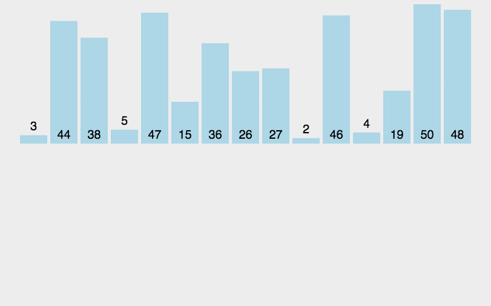

+ [author](https://github.com/3293172751)
<a href="https://github.com/3293172751" target="_blank"></a>

# 第2节 归并排序和时间复杂度

+ [回到目录](../README.md)
+ [回到项目首页](../../README.md)
+ [上一节](1.md)
> ❤️💕💕算法学习笔记和LeetCode的刷题笔记与记录。Myblog:[http://nsddd.top](http://nsddd.top/)
---
[TOC]

## 动画演示




### 步骤

+ 先拆分为一半

+ 先左边排好序

+ 再右边排好序

  

## 代码

```java
package class01
public class Max {
	public static int getMax(int[] arr ){
		return process(arr,0,arr.length-1)
    }
    
    //求arr[L...R]归并排序
    public static int process(int[] arr,int L,int R){
        if(L == R){
			return;  //left = right 
        }
       	
        int mid = L + ((R - L) >> 1);    //^1
        process(arr,L,mid);   //sort -- left  
        process(arr,mid + 1,R);   //sort -- right
        merge(arr,L,mid,R);   //all整体排序
    }
    
    public static void merge(int[] arr,int L,int mid,int R){
 		//1.先准备一个辅助空间，大小为总数
        int[] help = new int[R- L + 1];
        int i = 0;    //help下标从零开始
        int p1 = L;   //p1指针指向L为止
        int p2 = mid + 1; //p2指针指向mid + 1 位置
        while(p1 <= mid && p2 <= R){  //在不越界情况下
            help[i++] = arr[p1] <= arr[p2] ? arr[p1++]:arr[p2++];
            //先赋值再++
        }
        
        //最终会有一个越界，left或者right
        while(p1 <= mid){   
        	help[i++] = arr[p1++];    
        }  
        while(p2 > mid + 1){
			help[i++] = arr[p2++];
        } 
        
        //此时排序完成，我们将临时数组赋值给原来的数组
        for(i=0; i<help.length; i++) {
			arr[L+i] = help[i];
        }
    }
}
```


## 时间复杂度分析

**时间复杂度我们先判断归并排序是否可以用master定理**

```
process(arr,L,mid);   //sort -- left  
process(arr,mid + 1,R);   //sort -- right
merge(arr,L,mid,R);   //all整体排序
```

+ 整个数据的规模量是n的规模

+ 子问题是n/2的规模

+ 剩余的过程

  ```
  if(L == R){
  	return;  //left = right 
  }
  merge(arr,L,mid,R);   //all整体排序
  ```

  + 前面的if时间复杂度是O(1)，后面的merge的时间复杂度O(n)

+ 所以可以算出

  + a = 2
  + b = 2
  + d = 1

  $$
  log_ba = log _2 2 = d = 1
  $$

+ ②当d=log(b,a)时，时间复杂度为O((n^d)*logn)

## END 链接

+ [回到目录](../README.md)
+ [上一节](1.md)
+ [下一节](3.md)
---
+ [参与贡献❤️💕💕](https://github.com/3293172751/Block_Chain/blob/master/Git/git-contributor.md)