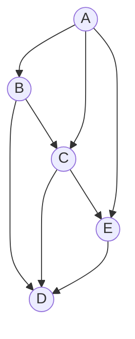

+ [author](https://github.com/3293172751)
<a href="https://github.com/3293172751" target="_blank"></a></p>
# 第20节 图的遍历
+ [回到目录](../README.md)
+ [回到项目首页](../../README.md)
+ [上一节](19.md)
> ❤️💕💕算法学习笔记和LeetCode的刷题笔记与记录。Myblog:[http://nsddd.top](http://nsddd.top/)
---
[TOC]


## 图的模板CPP

### 存储结构

点，边，图，三种类，不论是那种图无向图也好有向图也好，都可以用这种统一的结构来表示。

```c++
//存储结构----------------------------
class Edge;	//声明
//一个节点信息有：值，出度，入读，下一个节点，指向下一个节点的边
class Node {	
public:
	int value;
	int in;	//入度
	int out;	//出度
	vector<Node*> nexts;	//该点的终端节点集（即以该点发出指向的点集）
	vector<Edge*> edges;	//属于“我”的边，即以此节点为起点（发出）的边
	Node(int v) :value(v), in(0), out(0) {}	//构造函数
};
class Edge {		//边的信息有:权重，起点，终点
public:
	int weight;	//权重
	Node* from;	//边的起点
	Node* to;	//边的终点
	Edge(int w,Node* from,Node* to):weight(w),from(from),to(to){}	//构造函数

};
//图的信息有：点集,nodes节点编号和其节点信息映射，边信息集
class Graph {	
public:
	map<int, Node*> nodes;	//点集	
	set<Edge*> edges;	//边集
	Graph() {}
	~Graph() {	//析构
		//释放空间
		for (auto& kv : nodes) {
			if (kv.second) {
				delete(kv.second);
				kv.second = nullptr;	
			}
		}
		for (auto v : edges) {
			if (v) {
				delete(v);
			}
		}
	}
};
```


### createGraph

无论题目给什么图信息，都可以提炼出来三个信息，起点，权重，终点。如果题目是无向图，那一条无向边，可以看成两条有向边，依然可以用上图结构，如果图中的边没有权重，可以将权重设置为一默认值。

```c++
//N*3的矩阵，[from节点上的值，weight,to节点上的值]
//流程：遍历矩阵，一次提出起点，终点，权重信息，向图点集中添加起点终点信息，提炼出起点Node 、终点Node信息 ,new边Edge,
//	对起点终点进行信息完善，将new出的边加入到边集中
Graph* createGraph(vector<vector<int>> matrix) {
	Graph* graph = new Graph;	//建图
	int len = matrix.size();
	for (int i = 0; i < len; ++i) {
		int from = matrix[i][0];
		int weight = matrix[i][1];	//提炼出 边的权重，起点，终点
		int to = matrix[i][2];
		if (graph->nodes.find(from) == graph->nodes.end()) {	//map中找是否有起点的信息,无则添加
			graph->nodes[from] = new Node(from);
		}
		if (graph->nodes.find(to) == graph->nodes.end()) {	//map中找是否有终点的信息,无则添加
			graph->nodes[to] = new Node(to);
		}
		Node* fromNode = graph->nodes[from];			//找出边的起点节点和终点节点
		Node* toNode = graph->nodes[to];
		Edge* newEdge = new Edge(weight, fromNode, toNode);	//构造边
		fromNode->nexts.push_back(toNode);	//给起点节点的next添加终点节点
		fromNode->out++;		//出度++；
		toNode->in++;		//终点节点入度++
		fromNode->edges.push_back(newEdge);	//给起点添加边信息
		graph->edges.insert(newEdge);	//边信息添加到边集
	}
	return graph;
}
```

> 上述 createGraph 函数中的参数 matrix, 往往需要你自己手动构造提炼出来。有了这么一套万能的构图法后，之后无论遇到什么图，都可以用此通一表示，而根据此图结构又可以打造各种自己图算法模板。




> 从A出发
>
> ```
> 宽度优先：ABCED或者ACBED
> 深度优先：ABDCE
> ```
>
> 

## 图的宽度优先遍历

**遍历流程：**

1. 利用队列实现
2. 从源节点开始依次按照宽度进队列，然后弹出
3. 每弹出一个点，把该节点所有没有进过队列的邻接点放入队列
4. 直到队列变空


### 实现

> 对于宽度优先遍历，我只需要一个点的结构，图和树的区别是图是有环的

```java
public static void bfs(Node node) {  //只需要一个点接口 BFS
	if(node == null) {
        return; 
    }
    Queue<node> queue = new LinkedList<>();	// 进队列
    HashSet<Node> set = new HashSet<>();	//为上面服务，避免重复的遍历
    queue.add(node);
    set.add(node);
    while(!queue.isEmpty()) {
        Node cur = queue.poll();  //弹出一个结点
        System.out.pritnln(cur.value);	//打印出来 -- 可以是处理或者打印
        for(Node next : cur.nexts) {
            if(!set.contains(next)) {	
                //遍历下一个结点，如果set中没有该结点，依次加入set和queue
                set.add(next);
                queue.add(next);
            }
        }
    }
}
```


## 图的广度优先遍历

**遍历流程：**

1. 利用栈实现
2. 从源节点开始依次按照深度放入栈，然后弹出
3. 每弹出一个点，把该节点下一个没有进过栈的邻接点放入栈
4. 直到栈变空

 

### 实现

+ 设置一个栈
+ 设置一个set

```java
public static void dfs(Node node) {  //只需要一个点接口 BFS
	if(node == null) {
        return; 
    }
    Stack<node> stack = new Stack<>();	// 进栈
    HashSet<Node> set = new HashSet<>();	//为上面服务，避免重复的遍历
    stack.add(node);		//A
    set.add(node);
    System.out.pritnln(node.value);	//打印出来 -- 可以是处理或者打印
    while(!stack.isEmpty()) {
        Node cur = stack.poll();  //弹出一个结点
        for(Node next : cur.nexts) {	//A 的next
            if(!set.contains(next)) {	
                //遍历下一个结点，如果set中没有该结点，依次加入set和queue
                stack.push(cur);	//重新压入
                satck.push(next);	//压入下一个
                set.add(next);
                System.out.pritnln(node.value);	//打印出来 -- 可以是处理或者打印
                break;
            }
        }
    }
}
```


## END 链接
+ [回到目录](../README.md)
+ [上一节](19.md)
+ [下一节](21.md)
---
+ [参与贡献❤️💕💕](https://github.com/3293172751/Block_Chain/blob/master/Git/git-contributor.md)