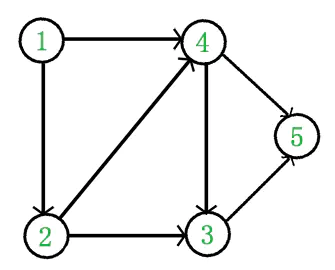

+ [author](https://github.com/3293172751)
<a href="https://github.com/3293172751" target="_blank"></a></p>
# 第21节 图的算法
+ [回到目录](../README.md)
+ [回到项目首页](../../README.md)
+ [上一节](20.md)
> ❤️💕💕算法学习笔记和LeetCode的刷题笔记与记录。Myblog:[http://nsddd.top](http://nsddd.top/)
---
[TOC]

## 拓扑排序算法

+ [x] [leetcode210](https://leetcode.cn/problems/course-schedule-ii/)
+ [x] [leetcode.com](https://leetcode.com/problems/course-schedule-ii/)

**适用范围：要求有向图，且有入度为0的节点，且没有环。**

> 在图论中，**拓扑排序（Topological Sorting**）是一个有向无环图（DAG, Directed Acyclic Graph）的所有顶点的线性序列。且该序列必须满足下面两个条件：
>
> 1. 每个顶点出现且只出现一次。
> 2. 若存在一条从顶点 A 到顶点 B 的路径，那么在序列中顶点 A 出现在顶点 B 的前面。
>
> 有向无环图（DAG）才有拓扑排序，非DAG图没有拓扑排序一说。
>
> 


### 实现

```cpp

```


## END 链接
+ [回到目录](../README.md)
+ [上一节](20.md)
+ [下一节](22.md)
---
+ [参与贡献❤️💕💕](https://github.com/3293172751/Block_Chain/blob/master/Git/git-contributor.md)