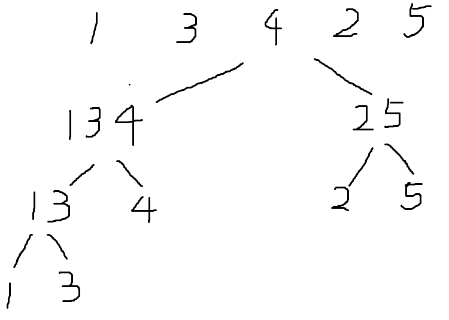

+ [author](https://github.com/3293172751)
<a href="https://github.com/3293172751" target="_blank"></a></p>
# 第4节 归并排序的一些案例
+ [回到目录](../README.md)
+ [回到项目首页](../../README.md)
+ [上一节](3.md)
> ❤️💕💕算法学习笔记和LeetCode的刷题笔记与记录。Myblog:[http://nsddd.top](http://nsddd.top/)
---
[TOC]

## 小和问题

#### 描述

在一个数组中，每一个数左边比当前数小的数累加起来，叫做这个数组的小和。求一个数组的小和。

#### 例子

[1,3,4,2,5]
1 左边比 1 小的数：没有
3 左边比 3 小的数：1
4 左边比 4 小的数：1,3
2 左边比 2 小的数：1
5 左边比 5 小的数：1,3,4,2
所以小和为 1+1+3+1+1+3+4+2=16

#### 解题思路



如果直接用两层 for 循环扫，时间复杂度是 O(n2)，但是可以通过归并排序的方法将时间复杂度降到 O (nlogn)
具体做法：归并排序分两步，一是**分**，二是**治**。分好说，不停的将数组划分为两部分，比如样例，最终划分为如下图所示的样子

```java
import java.util.Scanner;

public class Main {
    public static void main(String[] args) {
        Scanner cin = new Scanner(System.in);
        int n = cin.nextInt();
        int[] arr = new int[n];
        for (int i = 0; i < n; i++)
            arr[i] = cin.nextInt();
        System.out.println(smallSum(arr));
    }

    static int smallSum(int[] arr) {
        if (arr == null || arr.length == 0)
            return 0;
        return mergeSort(arr, 0, arr.length - 1);
    }

    static int mergeSort(int[] arr, int l, int r) {
        if (l == r)
            return 0;
        int mid = l + ((r - l) >> 1);
        return mergeSort(arr, l, mid) + // 左侧产生的小和
                mergeSort(arr, mid + 1, r) + // 右侧产生的小和
                merge(arr, l, mid, r); // merge过程中产生的小和
    }

    static int merge(int[] arr,int l,int m,int r) {
        int[] help = new int[r - l + 1];
        int i = 0;
        int p1 = l;
        int p2 = m + 1;
        int res = 0;
        while(p1 <= m && p2 <= r) {
            res += arr[p1] < arr[p2] ? (r - p2 + 1) * arr[p1] : 0;
            help[i++] = arr[p1] < arr[p2] ? arr[p1++] : arr[p2++];
        }
        while(p1 <= m) 
            help[i++] = arr[p1++];
        while(p2 <= r)
            help[i++] = arr[p2++];
        for(i = 0;i < help.length;i++)
            arr[i + l] = help[i];
        return res;
    }
}
```


## 求逆序对

+ [题目leetcode](https://leetcode.cn/problems/shu-zu-zhong-de-ni-xu-dui-lcof/)

在一个数组中，如果左边的数比右边的数要大，则这两个数构成一个逆序对，请打印所有的逆序对（请找到逆序对数量）。

#### 思路

逆序对问题使用[归并排序](https://so.csdn.net/so/search?q=归并排序&spm=1001.2101.3001.7020)的思想,在合并的时候,如果左边指针p1指向的数比右边指针p2指向的数要大，那么p1到中间位置的所有数都会比p2指针指向的数要大，这些都会是逆序对。

#### 解题

```java
public class Reverse {
    public static void reverse(int[] arr){
        if(arr == null || arr.length < 2){
            return;
        }
        mergeSort(arr,0,arr.length - 1);
    }

    private static void mergeSort(int[] arr, int L, int R) {
        if(L == R){
            return;
        }
        int mid = L + ((R - L) >> 1);
        mergeSort(arr,L,mid);
        mergeSort(arr,mid + 1,R);
        merge(arr,L,mid,R);
    }
    private static void merge(int[] arr, int l, int mid, int r) {
        int[] help = new int[r - l + 1];
        int p1 = l;
        int p2 = mid + 1;
        int current = 0;
        while(p1 <= mid && p2 <= r){
            if(arr[p1] > arr[p2]){      //p1指针右边的数比p2都要打
                for(int i = p1;i <= mid;i++)
                    System.out.println("["+arr[i]+","+arr[p2]+"]");  //打印逆序对
            }
            help[current++] = arr[p1] < arr[p2] ? arr[p1++] : arr[p2++];
        }
        while (p1 <= mid){
            help[current++] = arr[p1++];
        }
        while (p2 <= r){
            help[current++] = arr[p2++];
        }
        for (int i = 0;i < help.length;i++){
            arr[l + i] = help[i];
        }
    }
}

```


## END 链接

+ [回到目录](../README.md)
+ [上一节](3.md)
+ [下一节](5.md)
---
+ [参与贡献❤️💕💕](https://github.com/3293172751/Block_Chain/blob/master/Git/git-contributor.md)