+ [author](https://github.com/3293172751)
<a href="https://github.com/3293172751" target="_blank"></a></p>
# 第6节 堆结构
+ [回到目录](../README.md)
+ [回到项目首页](../../README.md)
+ [上一节](5.md)
> ❤️💕💕算法学习笔记和LeetCode的刷题笔记与记录。Myblog:[http://nsddd.top](http://nsddd.top/)
---
[TOC]

## 堆的基本存储

### 概念及其介绍

堆(Heap)是计算机科学中一类特殊的数据结构的统称。

**堆通常是一个可以被看做一棵完全二叉树的数组对象。**

> 相当于把一个完全二叉树放在数组中，而其中的左右孩子

+ `i`的左孩子：`2*i+1`
+ `i`的右孩子：`2*i+2`
+ `i`的父亲：$${\color{Red} \frac{i-1}{2} } $$

堆满足下列性质：

- 堆中某个节点的值总是不大于或不小于其父节点的值。
- 堆总是一棵完全二叉树。


#### 堆属性

堆分为两种：*最大堆*和*最小堆*，两者的差别在于节点的排序方式。

在最大堆中，父节点的值比每一个子节点的值都要大。在最小堆中，父节点的值比每一个子节点的值都要小。这就是所谓的“堆属性”，并且这个属性对堆中的每一个节点都成立。

例子：


这是一个最大堆，，因为每一个父节点的值都比其子节点要大。`10` 比 `7` 和 `2` 都大。`7` 比 `5` 和 `1`都大。

根据这一属性，那么最大堆总是将其中的最大值存放在树的根节点。而对于最小堆，根节点中的元素总是树中的最小值。堆属性非常有用，因为堆常常被当做优先队列使用，因为可以快速地访问到“最重要”的元素。

> **注意：**堆的根节点中存放的是最大或者最小元素，但是其他节点的排序顺序是未知的。例如，在一个最大堆中，最大的那一个元素总是位于 index 0 的位置，但是最小的元素则未必是最后一个元素。--唯一能够保证的是最小的元素是一个叶节点，但是不确定是哪一个。


##### 大分堆代码

> 父结点比子节点都大

```java
public static void heapInsert(int[] arr,int index){
//等找到某个数不再比父节点大，或者来到零位置（index - 1)/2 == 0),>也成立
	while(arr[index] > arr[(index - 1) / 2]){
		swap(arr,index,(index - 1)/2);
		index = (index - 1)/2;
	}
}
```

##### 小分堆代码

> 父节点比子节点都小

```go
package main
import ("fmt")

func main() {
	arr := []int{12,213,12,12,3,4,3,2,1}
   index := 6
   heapInsert(arr,index)
  fmt.Println("arr=",arr)
  fmt.Println("index=",index)
}
func heapInsert(arr []int,index int){
    for arr[index] < (arr[(index) - 1])>>1 {
        swap(arr,index,(index - 1)/2)
        index = (index - 1)>>1
    }
}

func swap(arr []int,a int, b int){
	arr[a], arr[b] = arr[b], arr[a]
}
```

**run**

```
arr= [12 213 12 12 3 4 3 2 1]
index= 6
```


##### 案例：找出最大值移除依旧是堆

```java
// 某一个数是在index位置，能否向下移动
public static void heapInsert(int[] arr,int index, int heapSize){
    //heapSize判断是否越界
    int left = index * 2 + 1;
	while(left < heapSize){
        //说明有左孩子  --  判断有无孩子
        
        //判断左右孩子大小,右孩子存在且右孩子大于左孩子
        int largest = left + 1 < heapSiza && arr[left] < arr[left + 1]?left + 1:left;
		
        //判断larget子孩子和父节点大小
        largest = arr[largest] > arr[inde]? largest:index;
        if(largest == index){break;}
        swap(arr,largest,index);
        index = largest;     //父结点继续往下走
        left = index * 2 + 1;
	}
}
```


### 适用说明

堆是利用完全二叉树的结构来维护一组数据，然后进行相关操作，一般的操作进行一次的时间复杂度在 **O(1)~O(logn)** 之间，堆通常用于动态分配和释放程序所使用的对象。

若为优先队列的使用场景，普通数组或者顺序数组，最差情况为 **O(n^2)**，堆这种数据结构也可以提高入队和出队的效率。

|          | 入队    |  出队  |
| :------: | :------ | :----: |
| 普通数组 | O(1)    |  O(n)  |
| 顺序数组 | O(n)    |  O(1)  |
|    堆    | O(logn) | O(log) |

> 由此看到堆结构很不错，无论是入队还是出队都是logN级别代价


### 结构图示

二叉堆是一颗完全二叉树，且堆中某个节点的值总是不大于其父节点的值，该完全二叉树的深度为 k，除第 k 层外，其它各层 (1～k-1) 的结点数都达到最大个数，第k 层所有的结点都连续集中在最左边。

其中堆的根节点最大称为最大堆，如下图所示：

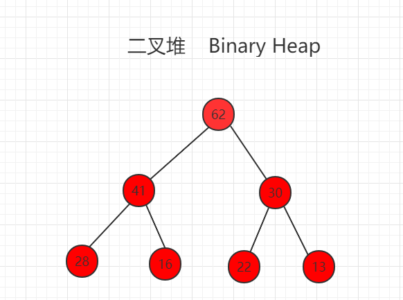

我们可以使用数组存储二叉堆，右边的标号是数组的索引。

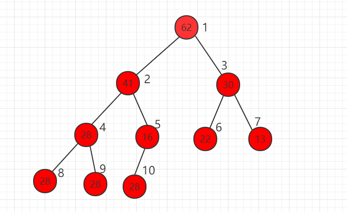

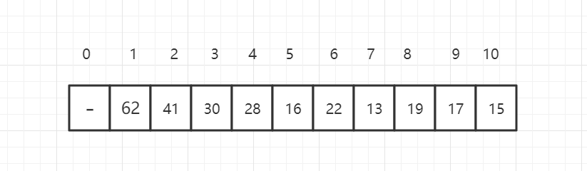

假设当前元素的索引位置为 i，可以得到规律：

```
parent(i) = i/2（取整）
left child(i) = 2*i
right child(i) = 2*i +1
```


## 堆的 shift up

向一个最大堆中添加元素，称为 **shift up**。

假设我们对下面的最大堆新加入一个元素52，放在数组的最后一位，52大于父节点16，此时不满足堆的定义，需要进行调整。

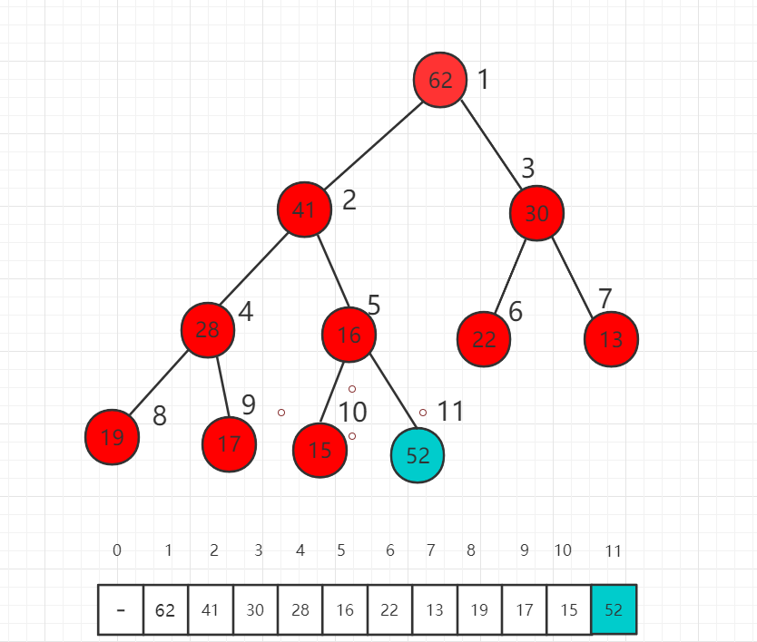

首先交换索引为 5 和 11 数组中数值的位置，也就是 52 和 16 交换位置。

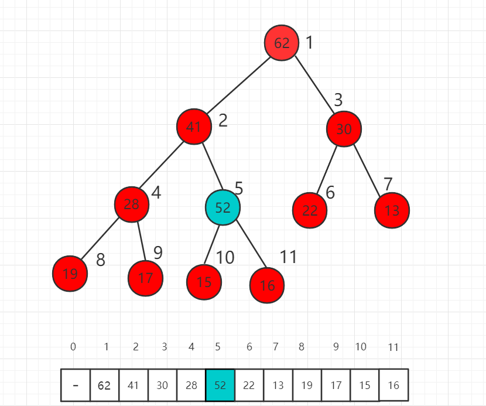

此时 52 依然比父节点索引为 2 的数值 41 大，我们还需要进一步挪位置。

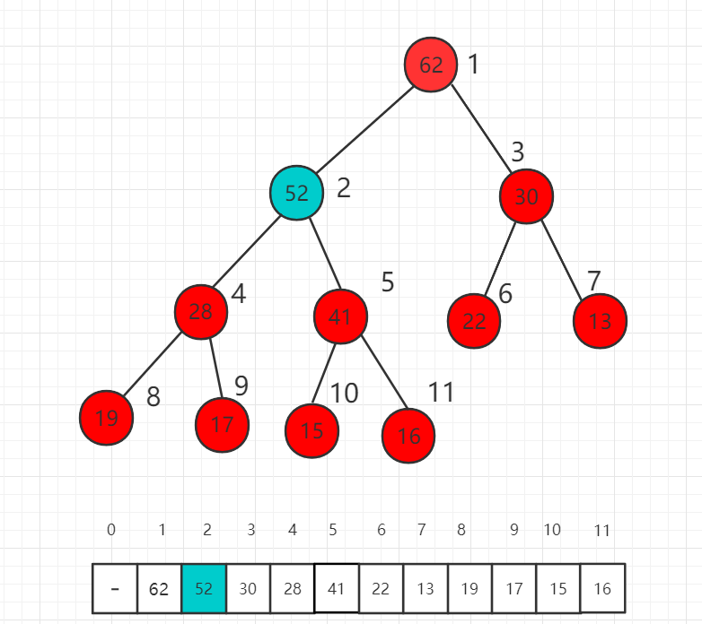

这时比较 52 和 62 的大小，52 已经比父节点小了，不需要再上升了，满足最大堆的定义。我们称这个过程为最大堆的 shift up。


##  堆的 shift down

**从一个最大堆中取出一个元素，称为 shift down**

只能取出最大优先级的元素，也就是根节点，把原来的 62 取出后，下面介绍如何填补这个最大堆。

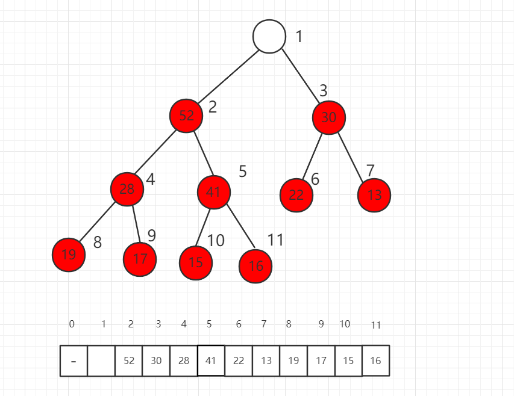

第一步，我们将数组最后一位数组放到根节点，此时不满足最大堆的定义。

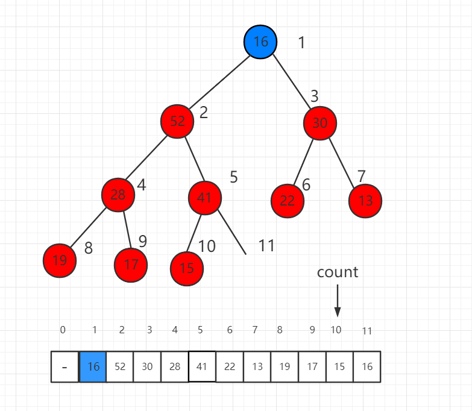

调整的过程是将这个根节点 16 一步一步向下挪，16 比子节点都小，先比较子节点 52 和 30 哪个大，和大的交换位置。

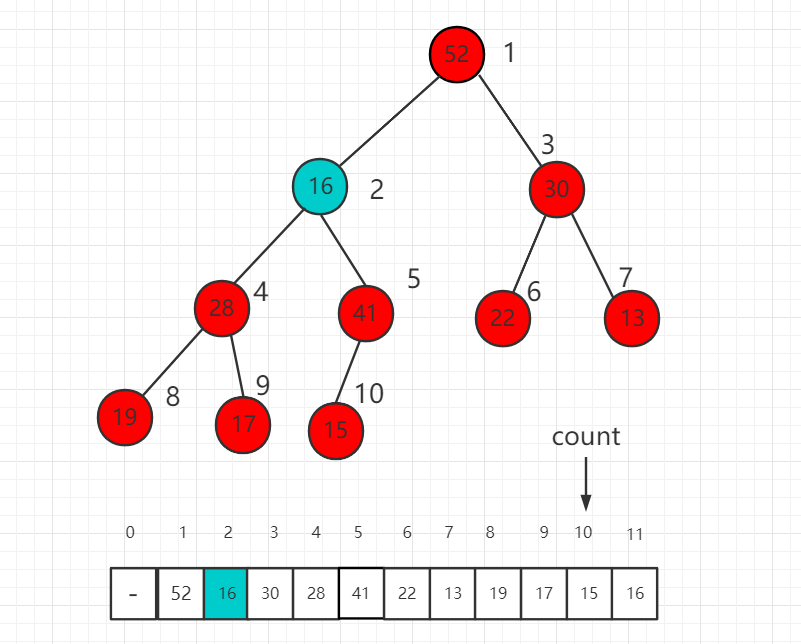

继续比较 16 的子节点 28 和 41，41 大，所以 16 和 41 交换位置。

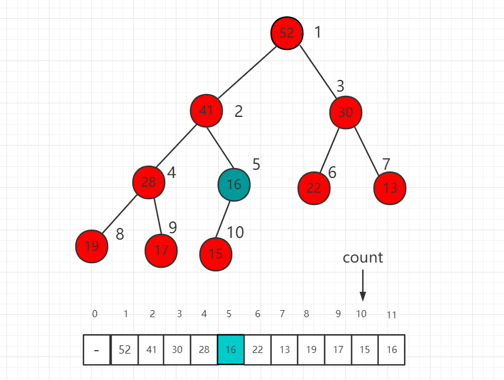

继续 16 和孩子节点 15 进行比较，16 大，所以现在不需要进行交换，最后我们的 shift down 操作完成，维持了一个最大堆的性质。


## 基础堆排序

### 概念及其介绍

堆排序（Heapsort）是指利用堆这种数据结构所设计的一种排序算法。

堆是一个近似 完全二叉树的结构，并同时满足堆积的性质：即子结点的键值或索引总是小于（或者大于）它的父节点。

### 适用说明

我们之前构造堆的过程是一个个数据调用 insert 方法使用 shift up 逐个插入到堆中，这个算法的时候时间复杂度是 **O(nlogn)**，本小节介绍的一种构造堆排序的过程，称为 **Heapify**，算法时间复杂度为 **O(n)**。

### 过程图示

完全二叉树有个重要性质，对于第一个非叶子节点的索引是 **n/2** 取整数得到的索引值，其中 **n** 是元素个数(前提是数组索引从 1 开始计算)。

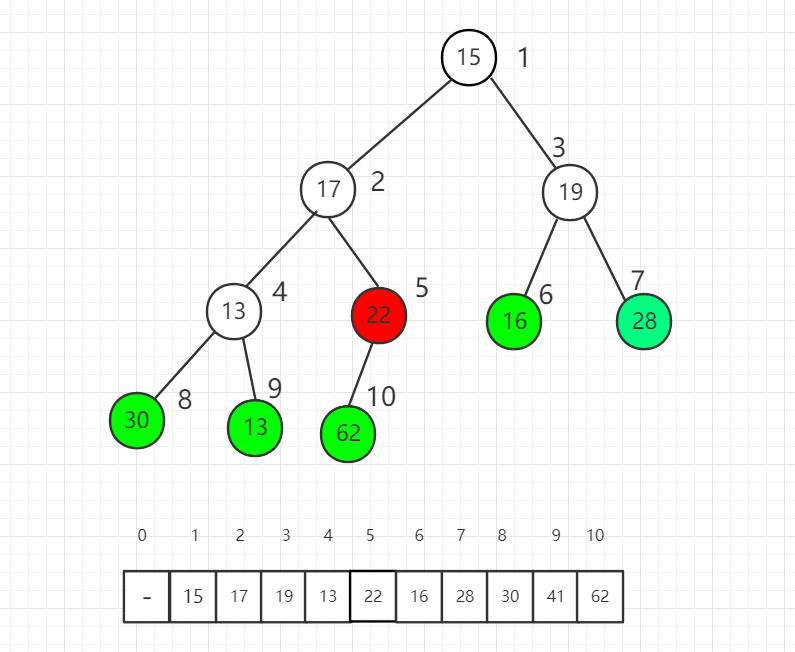

索引 5 位置是第一个非叶子节点，我们从它开始逐一向前分别把每个元素作为根节点进行 shift down 操作满足最大堆的性质。

索引 5 位置进行 shift down 操作后，22 和 62 交换位置。


对索引 4 元素进行 shift down 操作

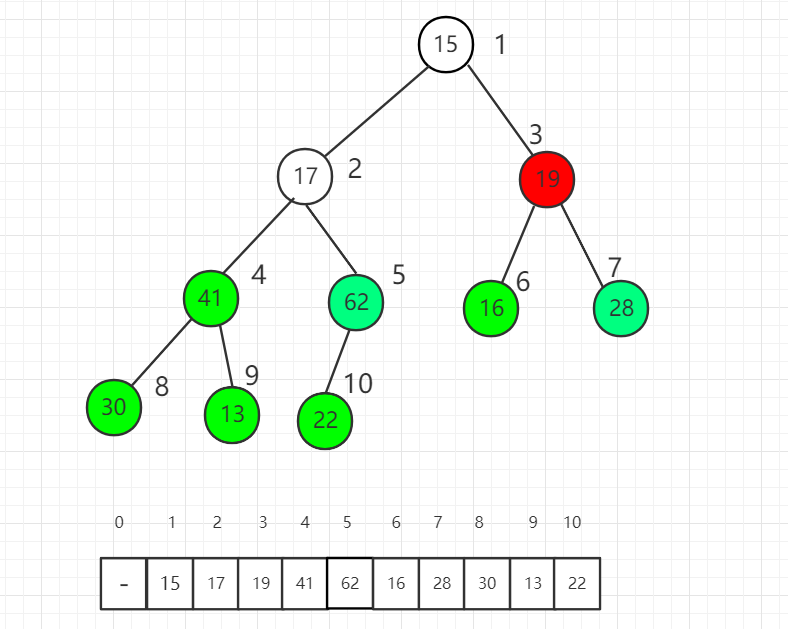

对索引 3 元素进行 shift down 操作

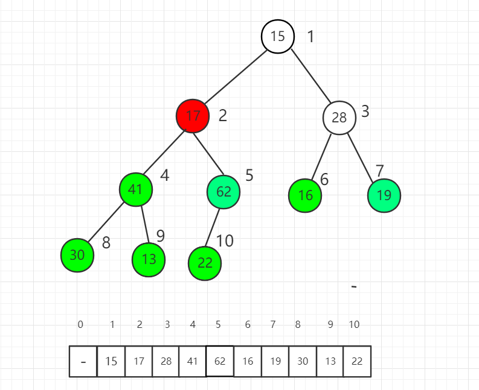

对索引 2 元素进行 shift down 操作

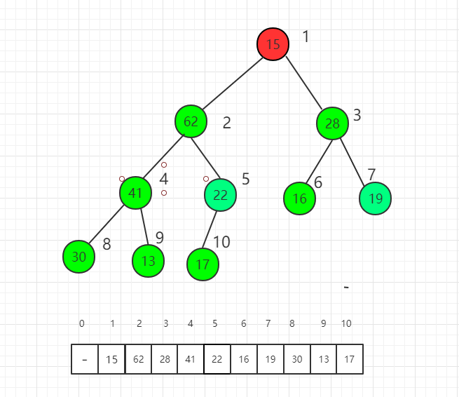

最后对根节点进行 shift down 操作，整个堆排序过程就完成了。

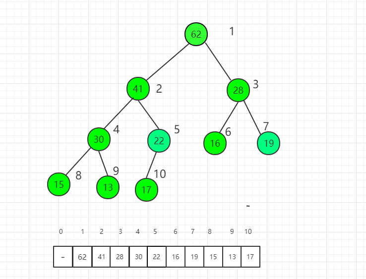

### 实例代码

+ [java代码地址🖱️](../code/java/sortTestHelper.java)

```java
import runoob.sort.SortTestHelper;

/**
 * 用heapify进行堆排序
 */
public class Heapify<T extends Comparable> {

    protected T[] data;
    protected int count;
    protected int capacity;

    // 构造函数, 通过一个给定数组创建一个最大堆
    // 该构造堆的过程, 时间复杂度为O(n)
    public Heapify(T arr[]){

        int n = arr.length;

        data = (T[])new Comparable[n+1];
        capacity = n;

        for( int i = 0 ; i < n ; i ++ )
            data[i+1] = arr[i];
        count = n;
        //从第一个不是叶子节点的元素开始
        for( int i = count/2 ; i >= 1 ; i -- )
            shiftDown(i);
    }
    // 返回堆中的元素个数
    public int size(){
        return count;
    }
    // 返回一个布尔值, 表示堆中是否为空
    public boolean isEmpty(){
        return count == 0;
    }
    // 像最大堆中插入一个新的元素 item
    public void insert(T item){
        assert count + 1 <= capacity;
        data[count+1] = item;
        count ++;
        shiftUp(count);
    }
    // 从最大堆中取出堆顶元素, 即堆中所存储的最大数据
    public T extractMax(){
        assert count > 0;
        T ret = data[1];
        swap( 1 , count );
        count --;
        shiftDown(1);
        return ret;
    }
    // 获取最大堆中的堆顶元素
    public T getMax(){
        assert( count > 0 );
        return data[1];
    }


    // 交换堆中索引为i和j的两个元素
    private void swap(int i, int j){
        T t = data[i];
        data[i] = data[j];
        data[j] = t;
    }

    //********************
    //* 最大堆核心辅助函数
    //********************
    private void shiftUp(int k){

        while( k > 1 && data[k/2].compareTo(data[k]) < 0 ){
            swap(k, k/2);
            k /= 2;
        }
    }

    private void shiftDown(int k){

        while( 2*k <= count ){
            int j = 2*k; // 在此轮循环中,data[k]和data[j]交换位置
            if( j+1 <= count && data[j+1].compareTo(data[j]) > 0 )
                j ++;
            // data[j] 是 data[2*k]和data[2*k+1]中的最大值

            if( data[k].compareTo(data[j]) >= 0 ) break;
            swap(k, j);
            k = j;
        }
    }

    // 测试 heapify
    public static void main(String[] args) {
        int N = 100;
        Integer[] arr = SortTestHelper.generateRandomArray(N, 0, 100000);
        Heapify<Integer> heapify = new Heapify<Integer>(arr);
        // 将heapify中的数据逐渐使用extractMax取出来
        // 取出来的顺序应该是按照从大到小的顺序取出来的
        for( int i = 0 ; i < N ; i ++ ){
            arr[i] = heapify.extractMax();
            System.out.print(arr[i] + " ");
        }

        // 确保arr数组是从大到小排列的
        for( int i = 1 ; i < N ; i ++ )
            assert arr[i-1] >= arr[i];
    }
}
```


**注意：堆排序是没有推结构重要的，堆排序使用的不是很多。**

### 案例

> 已知一个几乎有序的数组，几乎有序是指，如果把数组排好顺序的话，每个元素移动的距离可以不超过k，
>
> 并且k相对于数组来说比较小。请选择一个合适的排序算法针对这个数据进行排序给定一个int数组A，
>
> 同时给定A的大小n和题意中的k，请返回排序后的数组。
>
> 思路：使用空间复杂度为O（nlogn）中的堆排序，因为快速排序是随机选取一个数然后左右分段，归并排序是分成n
>
> 个只有一个元素的序列，他们与序列顺序关系不大，所以选用堆排序解决。
>
> 1.建立由k可元素的小顶堆，然后取出顶上元素
>
> 2.堆顶用没有建堆的下一元素替代，重新建堆
>
> 3.反复调用，完成排序，此算法因为每个元素移动都在k以内，所以时间复杂度为O（nlogk）

```java
class ScaleSort {
    public int[] sortElement(int[] A, int n, int k) {
    	if(n == 0 || n < k)
    		return A;
        int[] heap = Arrays.copyOf(A, k);
        //建立只有k个元素的小顶堆
        for(int i = k/2-1;i >= 0;i--)
        	heapCreate(heap,i,k);
        //核心：建完堆后取出堆顶，赋值给A第一元素，然后用后面从k到n个元素逐布替代
        for(int i = k;i < n;i++){
        	A[i-k] = heap[0];
        	heap[0] = A[i];
        	heapCreate(heap, 0, k);
        }
        //逐步建堆排序结束后，最后还有n-1-k+1到n-1的k个元素的完整堆
        //用普通堆排序思想输出
        //堆顶与最后一个元素交换
        for(int i = n-k;i < n;i++){
        	A[i] = heap[0];
        	//交换
        	int temp = heap[0];
        	heap[0] = heap[k-1];
        	heap[k-1] = temp;
        	//重新调整
        	heapCreate(heap, 0, --k);
        }
        return A;
    }
    //建小顶堆函数
    private void heapCreate(int[] heap,int i,int k){
    	int temp = heap[i];
    	for(int j = 2*i+1;j < k; j = 2*j+1){
    		if((j+1 < k)&&(heap[j] > heap[j+1]))
    			j++;
    		if(temp < heap[j])
    			break;
    		heap[i] = heap[j];
    		i = j;
    	}
    	heap[i] = temp;
    }
}
```


#### PriorityQueue – java

PriorityQueue本质还是一个FIFO的队列，是一个现成的堆结构，其特殊之处在于他的出队顺序是按照优先级进行比较的。在发送消息等应用场景还是经常用到的，还想起了消息中间件mq。

简单用法：

1 构建

```text
Queue<String> q = new PriorityQueue<>();//用的默认比较方式
```

或者

```text
PriorityQueue<Character> queue = new PriorityQueue<Character>(new Comparator<Character>()
        {
 public int compare(Character letter1, Character letter2)
            {
 return counts[letter2 - 'a'] - counts[letter1 - 'a'];//从出现频率大到小排列优先级
            }
        });
```

使用(和队列基本一样)

```text
queue.offer(‘a');   
queue.poll('b');   //弹出
queue.add(8);   //加入
```

## END 链接

+ [回到目录](../README.md)
+ [上一节](5.md)
+ [下一节](7.md)
---
+ [参与贡献❤️💕💕](https://github.com/3293172751/Block_Chain/blob/master/Git/git-contributor.md)