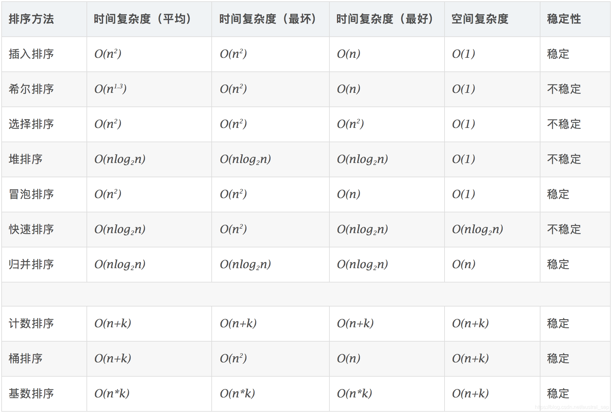

+ [author](https://github.com/3293172751)
<a href="https://github.com/3293172751" target="_blank"></a></p>
# 第8节 希尔排序
+ [回到目录](../README.md)
+ [回到项目首页](../../README.md)
+ [上一节](7.md)
> ❤️💕💕算法学习笔记和LeetCode的刷题笔记与记录。Myblog:[http://nsddd.top](http://nsddd.top/)
---
[TOC]

## 希尔排序

希尔排序，也称递减增量排序算法，是插入排序的一种更高效的改进版本。但希尔排序是**非稳定排序算法**。

希尔排序是基于插入排序的以下两点性质而提出改进方法的：

- 插入排序在对几乎已经排好序的数据操作时，效率高，即可以达到线性排序的效率；
- 但插入排序一般来说是低效的，因为插入排序每次只能将数据移动一位；

希尔排序的基本思想是：先将整个待排序的记录序列分割成为若干子序列分别进行直接插入排序，待整个序列中的记录“基本有序”时，再对全体记录进行依次直接插入排序。

### 1. 算法步骤


1. 选择一个增量序列 t1，t2，……，tk，其中 ti > tj, tk = 1；
2. 按增量序列个数 k，对序列进行 k 趟排序；
3. 每趟排序，根据对应的增量 ti，将待排序列分割成若干长度为 m 的子序列，分别对各子表进行直接插入排序。仅增量因子为 1 时，整个序列作为一个表来处理，表长度即为整个序列的长度。

### 2. JavaScript 代码实现

```javascript
function shellSort(arr) {
    var len = arr.length,
        temp,
        gap = 1;
    while(gap < len/3) {          //动态定义间隔序列
        gap =gap*3+1;
    }
    for (gap; gap > 0; gap = Math.floor(gap/3)) {
        for (var i = gap; i < len; i++) {
            temp = arr[i];
            for (var j = i-gap; j >= 0 && arr[j] > temp; j-=gap) {
                arr[j+gap] = arr[j];
            }
            arr[j+gap] = temp;
        }
    }
    return arr;
}
```

### 3. Python 代码实现

```python
def shellSort(arr):
    import math
    gap=1
    while(gap < len(arr)/3):
        gap = gap*3+1
    while gap > 0:
        for i in range(gap,len(arr)):
            temp = arr[i]
            j = i-gap
            while j >=0 and arr[j] > temp:
                arr[j+gap]=arr[j]
                j-=gap
            arr[j+gap] = temp
        gap = math.floor(gap/3)
    return arr
```

### 4. Go 代码实现

```go
func shellSort(arr []int) []int {
	length := len(arr)
	gap := 1
	for gap < length/3 {
		gap = gap*3 + 1
	}
	for gap > 0 {
		for i := gap; i < length; i++ {
			temp := arr[i]
			j := i - gap
			for j >= 0 && arr[j] > temp {
				arr[j+gap] = arr[j]
				j -= gap
			}
			arr[j+gap] = temp
		}
		gap = gap / 3
	}
	return arr
}
```

### 5. Java 代码实现

```java
public class ShellSort implements IArraySort {

    @Override
    public int[] sort(int[] sourceArray) throws Exception {
        // 对 arr 进行拷贝，不改变参数内容
        int[] arr = Arrays.copyOf(sourceArray, sourceArray.length);

        int gap = 1;
        while (gap < arr.length/3) {
            gap = gap * 3 + 1;
        }

        while (gap > 0) {
            for (int i = gap; i < arr.length; i++) {
                int tmp = arr[i];
                int j = i - gap;
                while (j >= 0 && arr[j] > tmp) {
                    arr[j + gap] = arr[j];
                    j -= gap;
                }
                arr[j + gap] = tmp;
            }
            gap = (int) Math.floor(gap / 3);
        }

        return arr;
    }
}
```

### 6. PHP 代码实现

```php
function shellSort($arr)
{
    $len = count($arr);
    $temp = 0;
    $gap = 1;
    while($gap < $len / 3) {
        $gap = $gap * 3 + 1;
    }
    for ($gap; $gap > 0; $gap = floor($gap / 3)) {
        for ($i = $gap; $i < $len; $i++) {
            $temp = $arr[$i];
            for ($j = $i - $gap; $j >= 0 && $arr[$j] > $temp; $j -= $gap) {
                $arr[$j+$gap] = $arr[$j];
            }
            $arr[$j+$gap] = $temp;
        }
    }
    return $arr;
}
```

### 7. C++ 代码实现

```cpp
void shellSort(vector<int>& arr) {
    int gap = 1;
    while (gap < (int)arr.size() / 3) {
    	gap = gap * 3 + 1;
    }
    for (; gap >= 1; gap /= 3) {
	for (int i = 0; i < gap; ++i) {
	    for (int j = i + gap; j < arr.size(); j += gap) {
		for (int k = j; k - gap >= 0 && arr[k] < arr[k - gap]; k -= gap) {
                    swap(arr[k], arr[k - gap]);
                }
            }
        }
    }
}

```

### 8. C代码实现

```c
void shellSort(int arr[], int n) //希尔 
{ 
	int gap,j,temp,i;
    for(gap = n/2;gap > 0;gap /= 2)//gap步长 
    {
        for(i = gap;i < n;i++) //i终将为n 
        { 
            temp = arr[i];            
            for(j = i;j >= gap && arr[j-gap] > temp;j = j-gap) 
                arr[j] = arr[j-gap]; 
            arr[j] = temp; 
        }
    } 
}
```


## 十大排序对比



> 一般的排序选择快速排序，快速排序虽然指标不是很好，但是经过实验的证明快排效果是最好的。

**归并是空间复杂度比较高，但是比较稳定**

**快排一般说的是快排3.0(随机快排）**

+  1.0和2.0版本的时间复杂度都是O(N^2) 
+  3.0版本时间复杂度是O(NlogN)


## END 链接

+ [回到目录](../README.md)
+ [上一节](7.md)
+ [下一节](9.md)
---
+ [参与贡献❤️💕💕](https://github.com/3293172751/Block_Chain/blob/master/Git/git-contributor.md)