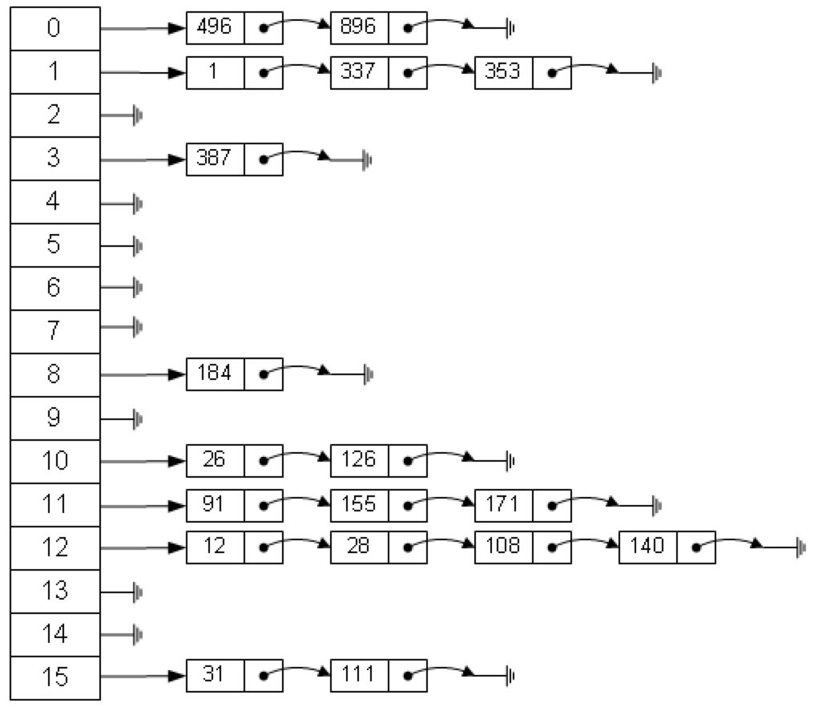

+ [author](https://github.com/3293172751)
<a href="https://github.com/3293172751" target="_blank"></a></p>

# 第9节 hash表和有序表

+ [回到目录](../README.md)
+ [回到项目首页](../../README.md)
+ [上一节](8.md)
> ❤️💕💕算法学习笔记和LeetCode的刷题笔记与记录。Myblog:[http://nsddd.top](http://nsddd.top/)
---
[TOC]

## 哈希表：

**哈希表**，是根据key值直接进行数据访问的数据结构。即通过一个hash函数，将key转换成换成数组的索引值，然后将value存储在该数组的索引位置。如下图：



> 1. 哈希表在使用层面可以理解为一种集合结构
> 2. 如果只有key，没有伴随数据value，可以使用HashSet结构(C++中叫UnOrderSet)
> 3. 如果既有key，又伴随数据value，可以使用HashMap结构(C++中叫UnOrderMap)
> 4. 有无伴随数据value，是HashMap和HashSet的唯一区别，底层结构是一样的(HashSet是通过HashMap实现的，只不过Value始终是PRESENT)
> 5. 哈希表的增/删/改/查可以认为时间复杂度为O(1)，但是常数时间较大
> 6. 放入哈希表的东西
>    + 如果是基础类型，内部按值传递，内存占用为这个东西的大小；
>    + 如果不是基础类型，内部按引用传递，内存占用是这个东西内存地址的大小

hash表的结构设计中一般有3个关键问题需要解决： 

+  **hash冲突**。即不同的key通过hash函数，会生成相同的hash值，即映射到相同的数组索引中。 
+  **空间浪费**。即如果两个key值，hash之后，生成的索引值差距较大，就会对数组空间产生浪费。 
+  **扩容问题**。即当现有的数组空间被填充满时，如何存储更多的键值。

hash冲突的解决一般采用拉链法（当然还有**开放地址法**等）。即当有两个不同的key，经过hash函数，被hash到同一个位置的时候，不直接存储在该索引下，而是将该值加到链表中，以免覆盖第一个具有相同hash的key值。如下图，假设a和b的hash值相同。

对于第二个问题，在go中是通过位操作来解决的。 即将key转换成hash值后，并不直接用hash作为索引，而是用hash和一个掩码值（一般是和底层数组个数或其相关的一个值）进行取模或位操作后得到对应数组的索引值。

第三个问题是涉及到空间增长和数据迁移，即重新分配更大的空间，将原有的key重新hash到新的空间的索引位置上。

### map数据结构

首先，整体来看下go中整体map的数据结构。如下图：


如上图，我们得知在map的数据结构中主要包含hmap，bmap两个结构体。

#### hmap结构体

在go中，我们初始化或创建一个map时，实际上是创建了一个hmap结构体。hmap的完整数据结构如下：

```go
type hmap struct {
	count      int //map中的元素个数
	flags      uint8
	B          uint8 //log_2的对数，即buckets的个数为2^B次方  
	noverflow  uint16 
	hash0      uint32 //hash种子
	buckets    unsafe.Pointer //bucket数组指针
	oldbuckets unsafe.Pointer //
	nevacuate  uintptr
	extra      *mapextra //溢出的buckets
}
```

例如我们用如下语句创建一个map变量：

```go
//创建一个容量为10的map
m := make(map[string]int, 16)
```

创建的hmap结构如下：


在hmap结构中，有以下几个重要的字段：

- **B** ：log_2的对数，即bucket的个数=2^B次方
- **hash0**：随机数的种子。Go运行时环境避免hash冲突使用。
- **buckets**：底层的buckets数组。
- **extra**：溢出的buckets数组。

### 数据结构中的B字段及其作用

根据上面的数据结构，我们可知，bucket的个数=2^B次方。那我们为什么需要这个B值呢？ **因为我们需要用B值和hash值经过一定的运算后，得到bucket数组范围内的索引index **。

我们在用map的时候，key是一个字符串，经过hash函数后转换成数组的索引。但这个哈希后的数字不一定在buckets的数组范围内。比如，我们的buckets数组个数是8个，一个key经过哈希函数转换成的哈希值是1378，那这个哈希值就不能直接作为buckets数组的索引来存储该value。而且，我们也不能直接扩展该数组的空间来存储该值，这样将会浪费太多的空间。

所以，我们需要B和hash进行按位与操作，以此将hash值落到bucket数组的范围之内。在go中代码实现如下：

```go
index := hash & (1 << B - 1)
```

### buckets

buckets是map结构中的底层存储结构，buckets本质上一个bmap类型的数组，即每个bucket指向一个bmap结构体。数组大小由B字段值决定。

```go
type bmap struct {
	tophash [8]uint8 //容量为8的数组，存储hash值的高位
	keys [8]keyType //该字段是在运行时阶段自动加入的，在源码中并没有。
	values [8]valueType //该字段是在运行时阶段自动加入的，在源码中并没有。
}
```

在bmap结构体中，tophash是一个固定容量的数组。值得注意的是keys和values的存储结构。key-value的存储并不是我们常见的key-value/key-value存储，而是以key0/key1/key2/…/key7/value0/value1/…/value7格式存储的。即先存8个key，再存8个value。这主要是考虑在内存对齐方面，可以避免浪费内存。

### 赋值操作

map的赋值操作如下：

```go
m['apple'] = 'mac'
```

赋值操作的目标，**是将apple经过hash之后，找到对应的bucket，并存储到bmap结构体中**。

计算步骤如下： 1、根据key生成hash值 2、根据hash和B计算bucket的索引 3、根据bucket索引和bucketsize计算得到buckets数组的起始地址 4、计算hash的高位值top 5、在tophash数组中依次该tophash值是否存在，如果存在，并且key和存储的key相等，则更新该key/value。如果不存在，则从tophash数组查找第一个空位置，保存该tophash和key/value

**场景一：tophash数组未满，且k值不存在时，则查找空闲空间，直接赋值** 

**场景二：tophash数组未满，且k值已经存在，则更新该k**


**场景三：tophash数组已满，且k值不在当前的bucket的tophash中，则从bmap结构体中的buoverflowt中查找，并做更新或新增**


### hash冲突

由上面的赋值操作可知，当遇到hash冲突的时候，go的解决方法是先在tophash的数组中查找空闲的位置，如果有空闲的位置则存入。如果没有空闲位置，则在bmap的overflow指针指向的bucket中的tophash中继续查，依次循环，直到找不等于该key的空闲位置，依次循环，直到从tophash中找到一个空闲位置为止。 


## java中哈希表使用

```java
public static void main(String[] args){
    HashMap<String,String>map = new HashMap<>();  //key:value(String)
    map.put("hello","我是xiongxinwei");
    System.out.println(map.containsKey("hello")); //true
    System.out.println(map.containsKey("helloword")); //false : 没有加helloword这个key
    System.out.println(map.get("hello")); //我是xiongxinwei
    
    //更新
    map.put("hello","他是xiongxinwei");   //更新的是value操作
    System.out.println(map.get("hello")); //他是xiongxinwei
    
    map.remove("hello");   //移除he
}
```


## 有序表：

> 1. 有序表在使用层面可以理解为一种集合结构
> 2. 如果只有key，没有伴随数据value，可以使用TreeSet结构(C++中叫OrderSet)
> 3. 如果既有key，又伴随数据value，可以使用TreeMap结构(C++中叫OrderMap)
> 4. 有无伴随数据value，是TreeSet和TreeMap的唯一区别，底层结构是一样的
> 5. 有序表的增/删/改/查可以认为时间复杂度为O(logN)
> 6. 红黑树、AVL树、size-balance-tree和跳表都属于有序表结构，只是底层具体实现不同
> 7. 放入有序表的东西
>    + 如果是基础类型，内部按值传递，内存占用为这个东西的大小；
>    + 如果不是基础类型，必须提供比较器（如下代码），且内部按引用传递，内存占用是这个东西内存地址的大小

```java
tree = new TreeSet<>(new NodeComparator());
//以下代码没问题，因为提供了NodeComparator（）比较器
//tree = new TreeSet<>();  --   下面加入nodeABC 一定会出错
try{
	treeSet.add(nodeA);
	treeSet.add(nodeB);
	treeSet.add(nodeC);
} catch(Exception e){
	System.out.println(e.getMessage());
}
```


## END 链接

+ [回到目录](../README.md)
+ [上一节](8.md)
+ [下一节](10.md)
---
+ [参与贡献❤️💕💕](https://github.com/3293172751/Block_Chain/blob/master/Git/git-contributor.md)